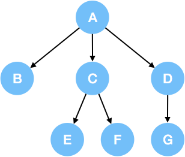

### N叉树

一颗以根结点开始, 每个结点不超过N个结点的树, 称为N叉树.

> 三叉树:
>
> 

前缀树, 又称为字典树(Trie), 就是一个常用的N叉树.

- N叉树的遍历 (中序遍历一般用不到)

  - 前序遍历

    在 N 叉树中，前序遍历指先访问根节点，然后逐个遍历***以其子节点为根的子树***。
    例如，上述三叉树的前序遍历是：A->B->C->E->F->D->G.

    ```java
    // 如果不用递归的话 一般都会用到一个ArrayList集合 或者是 一个栈
    /*
    // Definition for a Node.
    class Node {
        public int val;
        public List<Node> children;
    
        public Node() {}
    
        public Node(int _val) {
            val = _val;
        }
    
        public Node(int _val, List<Node> _children) {
            val = _val;
            children = _children;
        }
    };
    */
    
    class Solution {
        ArrayList<Integer> res = new ArrayList<Integer>();
        
        public List<Integer> preorder(Node root) { 
            preOrder(root);
            return res;        
        }
        public void preOrder(Node root) {
            if (root == null) {
                return;
            }
            res.add(root.val);
            for (int i = 0; i < root.children.size(); i++) {
                preOrder(root.children.get(i));
            }
        }
    } 
    ```

  - 后序遍历

    在 N 叉树中，后序遍历指前先逐个遍历***以根节点的子节点为根的子树***，最后访问根节点。
    例如，上述三叉树的后序遍历是：B->E->F->C->G->D->A.

    ```java
    /*
    // Definition for a Node.
    class Node {
        public int val;
        public List<Node> children;
    
        public Node() {}
    
        public Node(int _val) {
            val = _val;
        }
    
        public Node(int _val, List<Node> _children) {
            val = _val;
            children = _children;
        }
    };
    */
    
    class Solution {
        ArrayList<Integer> res = new ArrayList<Integer>();
        
        public List<Integer> postorder(Node root) {
            postOrder(root);
            return res;
        }
        public void postOrder(Node root) {
            if (root == null) {
                return;
            }
            for (int i = 0; i < root.children.size(); i++) {
                postOrder(root.children.get(i));
            }
            res.add(root.val);
        }
    }
    ```

  - 层序遍历(从左到右的顺序, 逐层遍历各个节点)

    N 叉树的层序遍历与二叉树的一致。通常，当我们在树中进行***广度优先搜索***时，我们将按***层序的顺序***进行遍历。
    例如，上述三叉树的层序遍历是：A->B->C->D->E->F->G.

    ```java
    /**
    	我们可以使用递归来解决这个问题，通常我们不能使用递归进行广度优先搜索。
    	这是因为广度优先搜索基于队列，而递归运行时使用堆栈，适合深度优先搜索。
    	但是在本题中，我们可以以#不同的顺序#添加到最终列表中，只要我们知道节点在哪一层并确保在那一层
    	列表顺序正确就可以了。
    */
    class Solution {
    
        private List<List<Integer>> result = new ArrayList<>();
    
        public List<List<Integer>> levelOrder(Node root) {
            if (root != null) traverseNode(root, 0);
            return result;
        }
    
        private void traverseNode(Node node, int level) {
            if (result.size() <= level) {
                result.add(new ArrayList<>());
            }
            result.get(level).add(node.val);
            for (Node child : node.children) {
                traverseNode(child, level + 1);
            }
        }
    }
    ```

    


