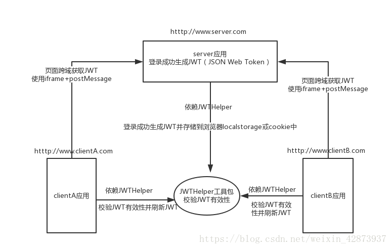
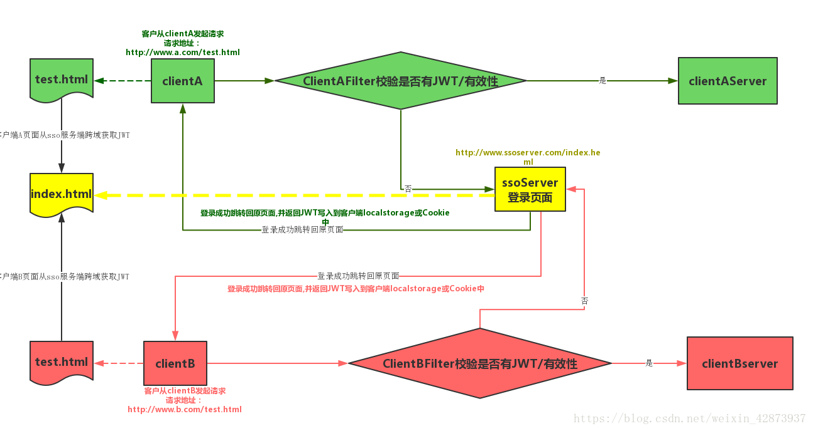
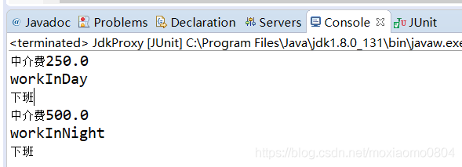

### Review2

一:

@Controller和@Service

@Controller

Controller 主要负责请求转发，接受页面过来的参数，传给Service处理，service接到返回值，再传给页面。

Controller，从字面上理解是***控制器***，所以它是负责***业务调度*** 的，所以在这一层应写一些业务的调度代码。而具体的业务处理应放在service中去写，而且service不单纯是对于dao的增删改查的调用，

@Service

service是***业务层***，所以应该更切近于***具体业务功能***要求，所以在这一层，一个方法所体现的是一个可以***对外***提供的功能。

就是对一个或多个DAO进行的***再次封装***，封装成一个服务，所以这里也就不会是一个原子操作了，需要***事物控制***。(在需要事务支持的地方加入***@Transactional注解***)

> 比如购物商城中的生成订单方法，这里面就不简单是增加个订单记录那么简单，
>
> 我们需要查询库存，核对商品等一系列实际业务逻辑的处理

DAO层(Data Access Object)

DAO层叫数据访问层，属于一种比较底层，比较基础的操作，具体到对于某个表的增删改查，也就是说某个DAO一定是和数据库的某一张表一一对应的，其中封装了增删改查基本操作，建议DAO只做***原子操作，增删改查。***


二:

Java 中sleep()和wait()的区别

- 这两个方法来自不同的类 sleep() 来自***Thread类***. 而wait()  来自***Object类***

  sleep是Thread的***静态类方法***，谁调用的谁去睡觉，即使在a线程里调用了b的sleep方法，实际上还是a去睡觉，要让b线程睡觉要在b的代码中调用sleep。

- 最主要是***sleep***方法***没有释放锁***，而***wait***方法***释放了锁***，使得***其他线程***可以使用同步控制块或者方法。

  sleep不出让系统资源；wait是进入线程等待池等待，出让系统资源，其他线程可以占用CPU。一般wait不会加时间限制，因为如果wait线程的运行资源不够，再出来也没用，要等待其他线程调用notify/notifyAll唤醒等待池中的所有线程，才会进入就绪队列等待OS分配系统资源。sleep(milliseconds)可以用时间指定使它自动唤醒过来，如果时间不到只能调用interrupt()强行打断。
  Thread.Sleep(0)的作用是“触发操作系统立刻重新进行一次CPU竞争”

- 使用范围：wait，notify和notifyAll只能在***同步控制方法*** 或者***同步控制块*** 里面使用，而sleep可以在***任何地方***使用

  ```java
  synchronized(x){ 
        x.notify() 
       //或者wait() 
  }
  ```

- sleep必须捕获异常，而wait，notify和notifyAll不需要捕获异常

总结:

- 两者都可以***暂停***线程的执行。

- 对于sleep()方法，我们首先要知道该方法是属于Thread类中的。而wait()方法，则是属于Object类中的。

- Wait 通常被用于***线程间交互/通信***，sleep 通常被用于***暂停执行***。

- sleep()方法导致了程序暂停执行指定的时间，让出cpu该其他线程，但是他的监控状态依然保持者，当指定的时间到了又会自动恢复运行状态。在调用sleep()方法的过程中，线程不会释放对象锁。

- 而当调用wait()方法的时候，线程会放弃对象锁，进入等待此对象的等待锁定池，只有针对此对象调用notify()方法后本线程才进入对象锁定池准备，获取对象锁进入运行状态。线程不会自动苏醒。


三:

死锁问题


四:

Java 用户用户密码加密

https://blog.csdn.net/u013068377/article/details/78921720

- Base64加密算法(编码方式)
- MD5加密(消息摘要算法，验证信息完整性)
- 对称加密算法
- 非对称加密算法
- 数字签名算法
- 数字证书

分类:

1. 按加密算法是否需要key被分为两类： 
   - 不基于key的有: Base64算法、MD5
   - 基于key的有: 对称加密算法、非对称加密算法、数字签名算法、数字证书、HMAC、RC4(对称加密)
2. 按加密算法是否可逆被分为两类： 
   - 单向加密算法(不可解密)：MD5、SHA、HMAC
   - 非单项加密算法(可解密)：BASE64、对称加密算法、非对称加密算法、数字签名算法、数字证书


JWT Oauth2 Shiro

- JWT(JSON Web Token)

  - JWT是一个含***签名***并携带***用户相关信息***的加密串，页面请求校验登录接口时，***请求头***中携带JWT串到***后端服务***，后端通过签名加密串匹配***校验***，保证信息未被篡改。校验通过则认为是可靠的请求，将***正常返回数据***。 

  - 使用情况

    授权: 解决单点登陆问题 服务端不用记录用户状态信息(无状态)

    信息交换: 各个服务之间安全传输信息

  - 结构

    头信息、有效载荷、签名  (xxx.yyy.zzz)

    - header: 头信息

    由两部分组成，***令牌类型***（即：JWT）、***散列算法***（HMAC、RSASSA、RSASSA-PSS等），

    例如：

    ```json
    {
      "alg": "HS256",
      "typ": "JWT"
    }
    ```

    然后，这个JSON被编码为***Base64Url***，形成JWT的第一部分。

    - Playload(有效载荷)

      其中包含***claims***。claims是关于实体（常用的是用户信息）和其他数据的声明，claims有三种类型:

       			**Registered claims：** 这些是一组预定义的claims，非强制性的，但是推荐使用， iss（发行人）， exp（到期时间）， sub（主题）， aud（观众）等；
       			**Public claims:** 自定义claims，注意不要和JWT注册表中属性冲突，[这里可以查看JWT注册表](https://www.iana.org/assignments/jwt/jwt.xhtml)
      			 **Private claims:** 这些是自定义的claims，用于在同意使用这些claims的各方之间共享信息，它们既不是Registered claims，也不是Public claims。

      ```json
      {
        "sub": "1234567890",
        "name": "John Doe",
        "admin": true
      }
      ```

      然后，再经过Base64Url编码，形成JWT的第二部分

    - Signature

      要创建签名部分，必须采用编码的Header，编码的Payload，秘钥，Header中指定的算法，并对其进行签名。

      例如，如果要使用HMAC SHA256算法，将按以下方式创建签名：

      ```JSON
      HMACSHA256(
        base64UrlEncode(header) + "." +
        base64UrlEncode(payload),
        secret)
      ```

- 项目中实际应用

  

  			 


```XML
<!--    权限控制的两种方法  只能使用一种-->
<security:global-method-security jsr250-annotations="enabled"></security:global-method-security>
<!--    <sercurity:global-method-security secured-annotations="enabled"></sercurity:global-method-security>-->
<!--    <security:global-method-security pre-post-annotations="enabled"></security:global-method-security>-->
```

jsr250 不是加密方式


五:

AOP底层实现

底层采用了***代理模式***, 分别是

- JDK动态代理 

  必须是***面向接口*** 的 只有实现了具体接口的类才能 生成代理对象

- CGLIB字节码增强

  对于没有实现了接口的类，也可以产生代理，产生***这个类的子类*** 的方式

代理模式(Proxy Pattern):

为其他对象提供一种代理以控制对这个对象的访问。在某些情况下，一个对象***不适合***或者***不能直接***引用另一个对象，而代理对象可以在客户端和目标对象之间起到***中介*** 的作用。

- 优点	

  职责清晰 代理对象 高扩展

- 结构

  一个是真正的要访问的对象(***目标类***) 另一个是***代理对象***

  真正的对象与代理对象实现***同一个接口***

  先访问代理类再访问真正要访问的对象

- JDK动态代理

  Java.lang.reflect.Proxy类可以直接生成一个代理对象

  **Proxy.newProxyInstance():**产生代理类的实例。仅能代理实现至少一个接口的类

  ​    ClassLoader：类加载器。固定写法，和被代理类使用相同的类加载器即可。

  ​    Class[] interface：代理类要实现的接口。固定写法，和被代理类使用相同的接口即可。

  ​    InvocationHandler：策略（方案）设计模式的应用。如何代理？

   

  **InvocationHandler****中的invoke****方法：**调用代理类的任何方法，此方法都会执行  

  ​     Object proxy:代理对象本身的引用。一般用不着。

  ​     Method method:当前调用的方法。

  ​     Object[] args:当前方法用到的参数

目标类接口：

```java
public interface WorkInter {
	void workInDay(double money);
	void workInNight(double money);
}
```

目标类：

```java
public class Worker implements WorkInter{
 
	@Override
	public void workInDay(double money) {
		System.out.println("workInDay");
		
	}
	@Override
	public void workInNight(double money) {
		System.out.println("workInNight");
	}
}
```

代理类：

```java
public class JdkProxy {
	@Test
	public void run() {
		WorkInter proxy = (WorkInter) Proxy.newProxyInstance(Worker.class.getClassLoader(), Worker.class.getInterfaces(), new InvocationHandler() {
			
			@Override
			public Object invoke(Object proxy, Method method, Object[] args) throws Throwable {
 
				System.out.println("中介费"+((double)args[0])/2);
				Object invoke = method.invoke(Worker.class.newInstance(), args);
				
				System.out.println("下班");
				return invoke;
			}
		});
		proxy.workInDay(500);
		proxy.workInNight(1000);
	}
}
```

执行结果:




- CGLIB字节码增强

  核心类：Enhancer

  1. 没有接口，只有实现类。
  2. 采用字节码增强框架 cglib，在运行时 创建目标类的子类，从而对目标类进行增强。

  实现步骤：

  1. 获得代理类的核心类Enhancer对象
  2. 设置父类（目标类），setSuperclass（）方法，底层是创建目标类的子类
  3. 设置回调函数enhancer.setCallback(new MethodInterceptor()) 
  4. 创建代理对象 create()方法

目标类：

```java
public class Worker{
	public void workInDay(double money) {
		System.out.println("workInDay");
		
	}
	public void workInNight(double money) {
		System.out.println("workInNight");
	}
}
```

代理类：

```java
public class WorkerProxy {
	@Test
	public void run() {
			Enhancer enhancer=new Enhancer();
			//2.设置父类（目标类），setSuperclass（）方法，底层是创建目标类的子类
			enhancer.setSuperclass(Worker.class);
			//3.设置回调函数enhancer.setCallback(new MethodInterceptor()) 
			
			enhancer.setCallback(new MethodInterceptor() {
				    *//**
				 * Object object:代理对象
				 * Method method:目标类的方法
				 * Object[] args:方法的形参
				 * MethodProxy methodProxy:方法的代理对象
				 * 
				 *//*
				@Override
				public Object intercept(Object object, Method method, Object[] args, MethodProxy methodProxy) throws Throwable {
					// TODO Auto-generated method stub
					//开启事务
					//前置通知
					
					System.out.println("代理收取费用"+ (double)args[0]/2);
					//执行目标方法，需要目标类实例
					Object invoke = method.invoke(Worker.class.newInstance(), (double)args[0]/2);
					
					//后置通知
					
					System.out.println("go  home~~~~~");
					return invoke;
				}
			});
			
			//4.创建代理对象 create()方法
			Worker workerPeoxy = (Worker) enhancer.create();
			
			workerPeoxy.workInDay(500);
			workerPeoxy.workInNight(1000);
	}
}
```

