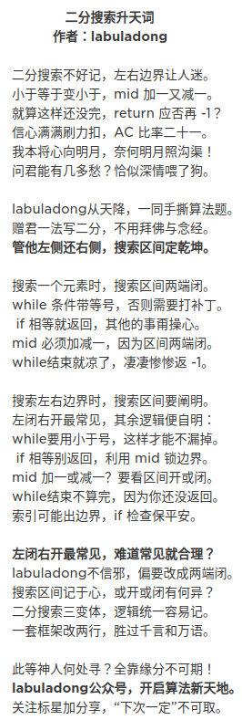

### 二分查找

在***有序***集合中搜索特定值的过程。

二分查找中使用的术语：

- 目标 Target —— 你要查找的值
- 索引 Index —— 你要查找的当前位置
- 左、右指示符 Left，Right —— 我们用来维持查找空间的指标
- 中间指示符 Mid —— 我们用来应用条件来确定我们应该向左查找还是向右查找的索引

查找空间: 对具有指定左索引和右索引的连续序列进行操作

> 二进制搜索可以采用许多替代形式，并且可能并不总是直接搜索特定值。有时您希望应用特定条件或规则来确定接下来要搜索的哪一侧（左侧或右侧）。


left + (right - left) / 2 返回中间位置的下标，判断并进行下一次二分(相当于把左面的东西砍掉 重新计算pivot)；这样算可以防止right+left可能会溢出的问题.


二分查找一般由三个主要部分组成：

- **预处理** —— 如果集合未排序，则进行排序。

- **二分查找** —— 使用循环或递归在每次比较后将查找空间划分为两半。

- **后处理** —— 在剩余空间中确定可行的候选者。

时将复杂度: O(logn)


三个二分查找的模板

模板I

```java
int binarySearch(int[] nums, int target){
  if(nums == null || nums.length == 0)
    return -1;

  int left = 0, right = nums.length - 1;
  while(left <= right){
    // Prevent (left + right) overflow
    int mid = left + (right - left) / 2;
    if(nums[mid] == target){ return mid; }
    else if(nums[mid] < target) { left = mid + 1; }
    else { right = mid - 1; }
  }

  // End Condition: left > right
  return -1;
}
```

> 模板I 用于查找可以通过访问数组中的***单个索引***来确定的元素或条件。

区分语法:

- 初始条件：left = 0, right = length-1
- 终止：left > right
- 向左查找：right = mid-1
- 向右查找：left = mid+1


int mid = low + (high - low) / 2 变成 int mid = (low + high)/2 会超时

> 考虑一个问题就是 (low+high)可能会出现***整形溢出*** 的现象,一旦出现就不能准确定位,就会出现混乱,导致死循环,  会很耗CPU的,这种现象很危险。所以, 最好的避免这种问题写法就是   int  mid=low+(high-low)/2,您可能会说以前使用数组时候也没出现这样的问题,  因为很少把数组元素填充到几个亿的大小，如果填充到几个亿,依然还会出现这样的问题.  

例子:

```java
high = 0100 0000 0000 0000 0000 0000 0000 0000 = 1073741824
 low = 0100 0000 0000 0000 0000 0000 0000 0000 = 1073741824
```


数组的局部是有序的，这还能进行二分搜索吗？答案是可以的。分为两种情况:

1. 当nums[start] <= nums[mid] 时 是前半部分有序

   因此如果 nums[start] <=target<nums[mid]，则在前半部分找，否则去后半部分找

2. 当nums[mid] < nums[end] 时 是后半部分有序

   因此如果 `nums[mid] <target<=nums[end]`，则在后半部分找，否则去前半部分找。


模板II

```java
int binarySearch(int[] nums, int target){
  if(nums == null || nums.length == 0)
    return -1;

  int left = 0, right = nums.length;
  while(left < right){
    // Prevent (left + right) overflow
    int mid = left + (right - left) / 2;
    if(nums[mid] == target){ return mid; }
    else if(nums[mid] < target) { left = mid + 1; }
    else { right = mid; }
  }

  // Post-processing:
  // End Condition: left == right
  if(left != nums.length && nums[left] == target) return left;
  return -1;
}
```

> 模板II 是二分查找的高级模板。它用于查找需要***访问数组中当前索引及其直接右邻居索引***的元素或条件(多适用于局部查找)

关键属性

一种实现二分查找的高级方法。
查找条件需要访问元素的直接右邻居。
使用元素的右邻居来确定是否满足条件，并决定是向左还是向右。
保证查找空间在每一步中至少有 2 个元素。
需要进行后处理。 当你剩下 1 个元素时，循环 / 递归结束。 需要评估剩余元素是否符合条件。

区分语法

初始条件：left = 0, right = length
终止：left == right
向左查找：right = mid
向右查找：left = mid+1

寻找峰值

若在题目描述中出现了 nums[-1] = nums[n] = -∞，这就代表着 只要数组中存在一个元素比相邻元素大，那么沿着它一定可以找到一个峰值

```java
class Solution {
    public int findPeakElement(int[] nums) {
        int left = 0, right = nums.length - 1;
        for (; left < right; ) {
            int mid = left + (right - left) / 2;
            if (nums[mid] > nums[mid + 1]) {
                right = mid;
            } else {
                left = mid + 1;
            }
        }
        return left;
    }
}
```

> 标签：二分查找
> 过程：
>
>     首先要注意题目条件，在题目描述中出现了 nums[-1] = nums[n] = -∞，这就代表着 只要数组中存在一个元素比相邻元素大，那么沿着它一定可以找到一个峰值
>     根据上述结论，我们就可以使用二分查找找到峰值
>     查找时，左指针 l，右指针 r，以其保持左右顺序为循环条件
>     根据左右指针计算中间位置 m，并比较 m 与 m+1 的值，如果 m 较大，则左侧存在峰值，r = m，如果 m + 1 较大，则右侧存在峰值，l = m + 1
>
> 时间复杂度：O(logN)O(logN)O(logN)
>


模板III

```java
int binarySearch(int[] nums, int target) {
    if (nums == null || nums.length == 0)
        return -1;

    int left = 0, right = nums.length - 1;
    while (left + 1 < right){
        // Prevent (left + right) overflow
        int mid = left + (right - left) / 2;
        if (nums[mid] == target) {
            return mid;
        } else if (nums[mid] < target) {
            left = mid;
        } else {
            right = mid;
        }
    }

    // Post-processing:
    // End Condition: left + 1 == right
    if(nums[left] == target) return left;
    if(nums[right] == target) return right;
    return -1;
}
```

> 搜索需要*访问当前索引及其在数组中的直接左右邻居索引*的元素或条件。
>
> 搜索条件需要访问元素的直接左右邻居。
> 使用元素的邻居来确定它是向右还是向左。
> 保证查找空间在每个步骤中至少有 3 个元素。
> 需要进行后处理。 当剩下 2 个元素时，循环 / 递归结束。 需要评估其余元素是否符合条件。

- 初始条件：left = 0, right = length-1
- 终止：left + 1 == right
- 向左查找：right = mid
- 向右查找：left = mid




***逻辑统一***

来梳理一下这些细节差异的因果逻辑：

- 第一个，最基本的二分查找算法：

```java
因为我们初始化 right = nums.length - 1
所以决定了我们的「搜索区间」是 [left, right]
所以决定了 while (left <= right)
同时也决定了 left = mid+1 和 right = mid-1

因为我们只需找到一个 target 的索引即可
所以当 nums[mid] == target 时可以立即返回
```

- 第二个，寻找左侧边界的二分查找：

```java
因为我们初始化 right = nums.length
所以决定了我们的「搜索区间」是 [left, right)
所以决定了 while (left < right)
同时也决定了 left = mid + 1 和 right = mid

因为我们需找到 target 的最左侧索引
所以当 nums[mid] == target 时不要立即返回
而要收紧右侧边界以锁定左侧边界
```

- 第三个，寻找右侧边界的二分查找：

```java
因为我们初始化 right = nums.length
所以决定了我们的「搜索区间」是 [left, right)
所以决定了 while (left < right)
同时也决定了 left = mid + 1 和 right = mid

因为我们需找到 target 的最右侧索引
所以当 nums[mid] == target 时不要立即返回
而要收紧左侧边界以锁定右侧边界

又因为收紧左侧边界时必须 left = mid + 1
所以最后无论返回 left 还是 right，必须减一
```

对于寻找左右边界的二分搜索，常见的手法是使用左闭右开的「搜索区间」，我们还根据逻辑将「搜索区间」全都统一成了两端都闭，便于记忆，只要修改两处即可变化出三种写法：

```java
int binary_search(int[] nums, int target) {
    int left = 0, right = nums.length - 1; 
    while(left <= right) {
        int mid = left + (right - left) / 2;
        if (nums[mid] < target) {
            left = mid + 1;
        } else if (nums[mid] > target) {
            right = mid - 1; 
        } else if(nums[mid] == target) {
            // 直接返回
            return mid;
        }
    }
    // 直接返回
    return -1;
}

int left_bound(int[] nums, int target) {
    int left = 0, right = nums.length - 1;
    while (left <= right) {
        int mid = left + (right - left) / 2;
        if (nums[mid] < target) {
            left = mid + 1;
        } else if (nums[mid] > target) {
            right = mid - 1;
        } else if (nums[mid] == target) {
            // 别返回，锁定左侧边界
            right = mid - 1;
        }
    }
    // 最后要检查 left 越界的情况
    if (left >= nums.length || nums[left] != target)
        return -1;
    return left;
}


int right_bound(int[] nums, int target) {
    int left = 0, right = nums.length - 1;
    while (left <= right) {
        int mid = left + (right - left) / 2;
        if (nums[mid] < target) {
            left = mid + 1;
        } else if (nums[mid] > target) {
            right = mid - 1;
        } else if (nums[mid] == target) {
            // 别返回，锁定右侧边界
            left = mid + 1;
        }
    }
    // 最后要检查 right 越界的情况
    if (right < 0 || nums[right] != target)
        return -1;
    return right;
}
```


