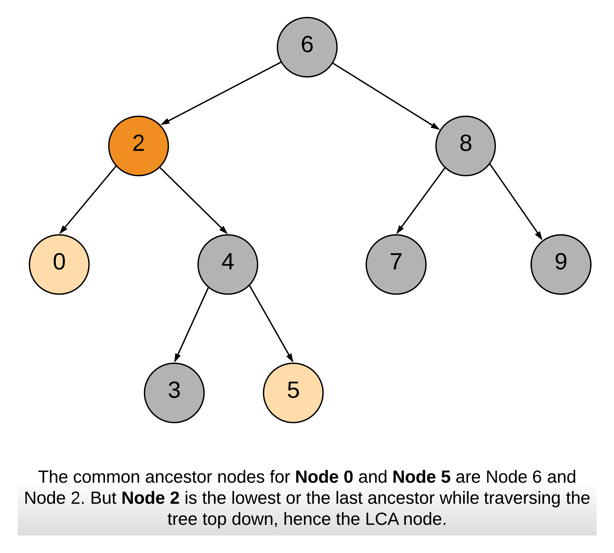

### 二叉搜索树(BST)


- 每个节点中的值必须大于（或等于）其左侧子树中的任何值，但小于（或等于）其右侧子树中的任何值。

- 对于二叉搜索树，我们可以通过***中序遍历*** 得到一个***递增的*** 有序序列。因此，中序遍历是二叉搜索树中最常用的遍历方法。

- 验证:

  ```java
  /**
   * Definition for a binary tree node.
   * public class TreeNode {
   *     int val;
   *     TreeNode left;
   *     TreeNode right;
   *     TreeNode(int x) { val = x; }
   * }
   */
  class Solution {
      List<Integer> res = new ArrayList<>();
      public boolean isValidBST(TreeNode root) {
          // In-Order traversal and judge if not the ascending array
          if (root == null) return true;
          inOrder(root);
          for (int i = 1; i < res.size(); i++) {
              if (res.get(i) <= res.get(i-1)) return false;
          }
          return true;
      }
  
      public void inOrder(TreeNode root) {
          if (root != null) {
              inOrder(root.left);
              res.add(root.val); // 中序遍历后的值放到数组里面
              inOrder(root.right);
          }
      }
  }
  ```

- 在计算机程序设计中，迭代器是使程序员能够遍历容器的对象。这是维基百科对迭代器的定义。当前，实现迭代器的最简单的方法是在类似数组的容器接口上。如果我们有一个数组，则我们只需要***一个指针***或者***索引***，就可以轻松的实现函数 next() 和 hasNext()。判断hasNext()的时候可以看索引是否大于结果集的长度即可。


- 在二叉搜索树中实现***搜索***

  根据BST的特性，对于每个节点：

  1. 如果目标值***等于***节点的值，则***返回***节点；
  2. 如果目标值***小于***节点的值，则继续在***左子树***中搜索；
  3. 如果目标值***大于***节点的值，则继续在***右子树***中搜索。

- 在二叉搜索树中实现***插入***

  为目标节点找出合适的叶节点位置，然后将该节点作为叶节点插入。

  1. 根据节点值与目标节点值的关系，搜索左子树或右子树；
  2. 重复步骤 1 直到到达外部节点；
  3. 根据节点的值与目标节点的值的关系，将新节点添加为其左侧或右侧的子节点。

- 在二叉搜索树中实现***删除***

  1. 如果目标节点没有子节点，我们可以直接移除该目标节点。
  2. 如果目标节只有一个子节点，我们可以用其子节点作为替换。
  3. 如果目标节点有两个子节点，我们需要用其中序后继节点或者前驱节点来替换，再删除该目标节点。

  后继结点: 

  Successor 代表的是中序遍历序列的下一个节点。即比当前节点大的最小节点，简称后继节点。 先取当前节点的右节点，然后一直取该节点的左节点，直到左节点为空，则最后指向的节点为后继节点。

  ```java
  public int successor(TreeNode root) {
      root = root.right;
      while (root.left != null) root = root.left;
      return root;
  }
  ```

  前驱结点: 

  Predecessor 代表的是中序遍历序列的前一个节点。即比当前节点小的最大节点，简称前驱节点。先取当前节点的左节点，然后取该节点的右节点，直到右节点为空，则最后指向的节点为前驱节点。

  ```java
  public int predecessor(TreeNode root) {
      root = root.left;
      while (root.right != null) root = root.right;
      return root;
  }
  ```

  

  删除的三种情况:

  - 删除的是叶子结点---直接删除

  - 删除的结点不是叶子节点且***拥有右节点***，则该节点可以由该节点的***后继节点进行替代***，该后继节点位于右子树中较低的位置。

  - 删除的节点不是叶子节点且***拥有左节点***。则该节点可以由该节点的***前驱节点进行替代***，该前驱结点位于左子树中较低的位置。


- 小结: 通常来说，如果想***有序地***存储数据或者需要***同时***执行***搜索、插入、删除***等***多步操作***，二叉搜索树这个数据结构是一个很好的选择.

  二叉搜索树的有优点是，即便在***最坏***的情况下，也允许你在***`O(h)`的时间复杂度***内执行所有的搜索、插入、删除操作。

  - 数据流中的最大元素

    ```java
    class KthLargest {
            
      private class BST {
          
          private class TreeNode {
              
              private int val;
              // 结点的count包含自己，所以默认是1
              private int count = 1;
              private TreeNode left;
              private TreeNode right;
              
              TreeNode(int x) { val = x; }
          }
          
          private TreeNode root;
          
          public void add(int val) {
              root = add(root, val);
          }
          
          private TreeNode add(TreeNode node, int val) {
              if (node == null) {
                  return new TreeNode(val);
              }
              if (node.val > val) {
                  node.left = add(node.left, val);
              } else if (node.val < val) {
                  node.right = add(node.right, val);
              }
              // 元素重复 不添加进树但是count++
              node.count++;
              return node;
          }
          
          public TreeNode search(int k) {
              return search(root, k);
          }
          
          private TreeNode search(TreeNode node, int k) {
              if (node == null) {
                  return node;
              }
              int leftNodeCount = node.left != null ? node.left.count : 0;
              int rightNodeCount = node.right != null ? node.right.count : 0;
              int currNodeCount = node.count - leftNodeCount - rightNodeCount;
              if (k > currNodeCount + rightNodeCount ) {
                  // k > 当前结点数加右子树的结点数，则搜索左子树
                  return search(node.left, k - currNodeCount - rightNodeCount);
              } else if (k <= rightNodeCount) {
                  // k <= 右子树的结点数，则搜索右子树
                  return search(node.right, k);
              } else {
                  // k == 当前结点数加右子树的结点数，则找到第k大的结点
                  return node;
              }
          }
      }
      
      private int k;
      private BST bst = new BST();
    
      public KthLargest(int k, int[] nums) {
          this.k = k;
          for (int n : nums) {
              bst.add(n);
          }
      }
      
      public int add(int val) {
          bst.add(val);
          return bst.search(k).val;
      }
    }
    ```

- 最近的公共祖先

  

  ​	自平衡的二叉搜索树

  ​	*自平衡* 这个词的意思是，这个树在随机进行`插入`,`删除`操作之后，它会自动保证树的高度最小

  - 非自平衡 -> 线性时间 O(n)

  ```java
              6
             /
            5
           /
          4
         /
        3
       /
      2
     /
    1
  ```

  - 自平衡 -> 非线性时间 O(logn)

  ```java
            4
          /   \
         2     6
        / \   /
       1   3  5
  ```


- 高度平衡的二叉树

  1. 树结构中的常见用语:
     - 节点的***深度*** - 从树的***根节点***到该节点的***边数***
     - 节点的***高度*** - 该节点和***叶子***之间最长路径上的***边数***
     - 树的高度 - 其***根节点***的***高度***

  2.  *`N`* 个节点的平衡二叉搜索树，它的高度是 *`logN`* 。且每个节点的两个子树的高度不会相差超过 1。

  3. 判断是否是二叉平衡树: 
     - 计算结点总数N和树的高度H: H=logN
     - 每个节点的两个子树的深度不会相差超过 1。递归的验证

  4. 为什么要用到这个高度平衡的二叉搜索树?

     因为一个普通的二叉树在最坏的情况下会退化成一个链表，时间复杂度会达到O(n)

  5. 树集合，Java 中的 Treeset 或者 C++ 中的 set ，是由高度平衡的二叉搜索树实现的。因此，搜索、插入和删除的时间复杂度都是 O(logN) 。

     哈希集和树集之间的本质区别在于树集中的键是`有序`的。

  6. 

​		

​		


