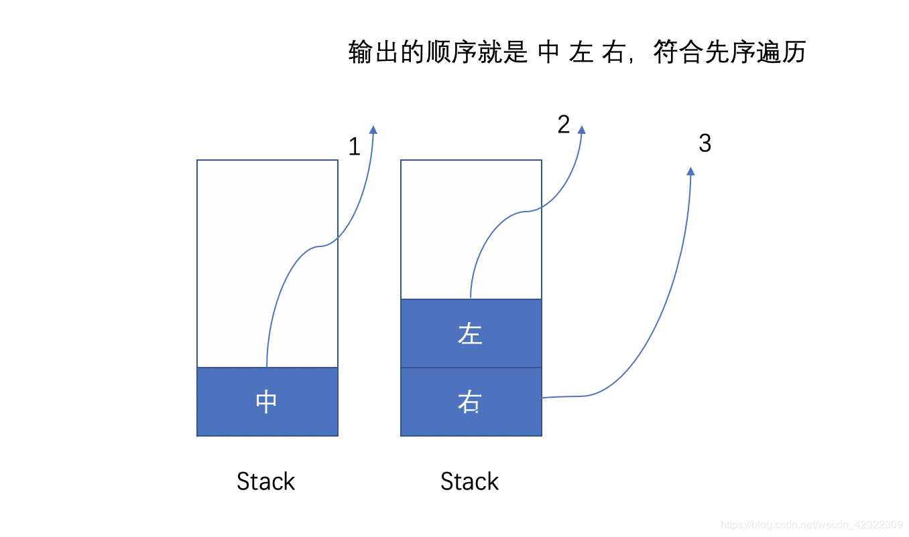
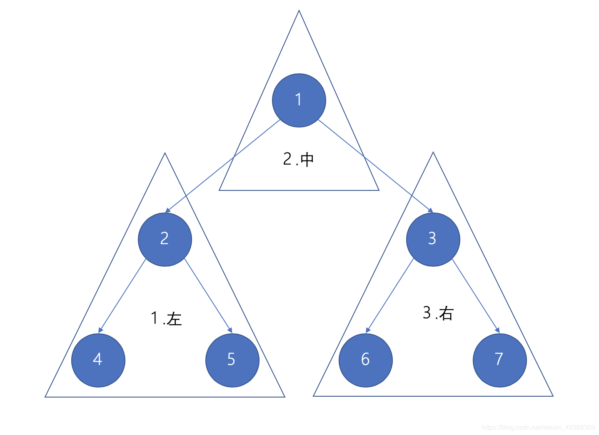
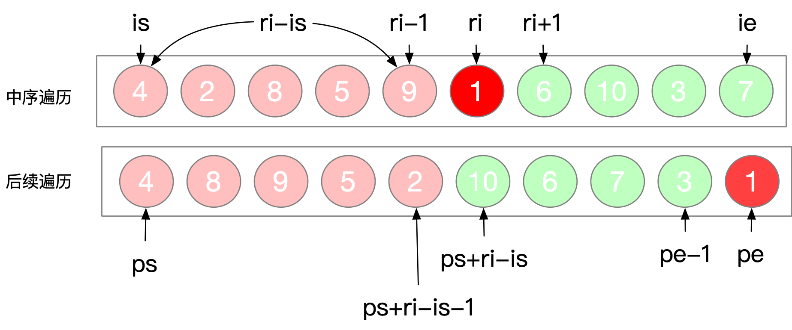

### 二叉树

树里的每一个节点有一个值和一个包含所有子节点的列表。

从图的观点来看，树也可视为一个拥有***N 个节点***和***N-1 条边***的一个有向无环图。

迭代解法

本质上是在模拟递归，因为在递归的过程中使用了系统栈，所以在迭代的解法中常用`Stack`来模拟系统栈。

树的遍历:

- 二叉树的高度

  - DFS (先序, 中序, 后序)

    ```java
    /** 本质上是后序遍历 */
    class Solution {
        public int maxDepth(TreeNode root) {
            if(root == null) return 0;
            return Math.max(maxDepth(root.left), maxDepth(root.right)) + 1;
        }
    }
    ```

    

  - BFS (层次遍历)

    ```java
    /** BFS通常用队列来是实现 
    	每遍历一层 计数器 +1
    	直到遍历完成queue为空
    */
    class Solution {
        public int maxDepth(TreeNode root) {
            if(root == null) return 0;
            List<TreeNode> queue = new LinkedList<>() {{ add(root); }}, tmp;
            int res = 0;
            while(!queue.isEmpty()) {
                tmp = new LinkedList<>();
                for(TreeNode node : queue) {
                    if(node.left != null) tmp.add(node.left);
                    if(node.right != null) tmp.add(node.right);
                }
                queue = tmp;
                res++;
            }
            return res;
        }
    }
    ```

    

- 前序 根->左->右

  首先我们应该创建一个`Stack`用来存放节点，首先我们想要打印根节点的数据，此时`Stack`里面的内容为空，所以我们优先将头结点加入`Stack`，然后打印。

  之后我们应该先打印左子树，然后右子树。所以先加入`Stack`的就是右子树，然后左子树。
   此时你能得到的流程如下:

  

  ```java
  public static void preOrderIteration(TreeNode head) {
  	if (head == null) {
  		return;
  	}
  	Stack<TreeNode> stack = new Stack<>();
  	stack.push(head);
  	while (!stack.isEmpty()) {
  		TreeNode node = stack.pop();
  		System.out.print(node.value + " ");
  		if (node.right != null) {
  			stack.push(node.right);
  		}
  		if (node.left != null) {
  			stack.push(node.left);
  		}
  	}
  }
  
  ```

- 中序 左->根->右

  1. 同理创建一个Stack，然后按 左 中 右的顺序输出节点。

  2. 尽可能的将这个节点的左子树压入Stack，此时栈顶的元素是最左侧的元素，<u>其目的是找到一个最小单位的子树(也就是最左侧的一个节点)，并且在寻找的过程中记录了来源，才能返回上层</u>,同时在返回上层的时候已经处理完毕左子树了。。

  3. 当处理完最小单位的子树时，返回到上层处理了中间节点。（如果把整个左中右的遍历都理解成子树的话，就是处理完 左子树->中间(就是一个节点)->右子树）

  4. 如果有右节点，其也要进行中序遍历。

     

     当整个左子树退栈的时候这个时候输出了该子树的根节点 2，之后输出中间节点 1。然后处理根节点为3右子树。

  ```java
  public static void inOrderIteration(TreeNode head) {
  	if (head == null) {
  		return;
  	}
  	TreeNode cur = head;
  	Stack<TreeNode> stack = new Stack<>();
  	while (!stack.isEmpty() || cur != null) {
  		while (cur != null) {
  			stack.push(cur);
  			cur = cur.left;
  		}
  		TreeNode node = stack.pop();
  		System.out.print(node.value + " ");
  		if (node.right != null) {
  			cur = node.right;
  		}
  	}
  }
  ```

- 后序 左->右->根

  1. 前序遍历的过程 是 中左右。
  2. 将其转化成 中右左。也就是压栈的过程中优先压入左子树，在压入右子树。
  3. 然后将这个结果返回来，这里是利用栈的先进后出倒序打印。

  ```java
  public static void postOrderIteration(TreeNode head) {
  		if (head == null) {
  			return;
  		}
  		Stack<TreeNode> stack1 = new Stack<>();
  		Stack<TreeNode> stack2 = new Stack<>();
  		stack1.push(head);
  		while (!stack1.isEmpty()) {
  			TreeNode node = stack1.pop();
  			stack2.push(node);
  			if (node.left != null) {
  				stack1.push(node.left);
  			}
  			if (node.right != null) {
  				stack1.push(node.right);
  			}
  		}
  		while (!stack2.isEmpty()) {
  			System.out.print(stack2.pop().value + " ");
  		}
  	}
  }
  ```

  > 后序在数学表达中被广泛使用。 编写程序来解析后缀表示法更为容易。 
  >
  > 这里是一个例子
  >
  > 
  >
  > 


##### 完全模仿递归，不变一行。秒杀全场，一劳永逸

####  解题思路：

如果你只想掌握其中某一种遍历大可去找那些奇技淫巧的题解（一会判断指针一会儿判断栈就问你怕不怕？面试的时候你能想起来？）；如果你想统一掌握三种遍历，并且希望思路清晰，我强烈建议你阅读下去！因为这里介绍的是递归转迭代的思路，而不仅仅是用迭代的形式完成题目。本题解也是双 100% 哦！

[老思路链接](https://leetcode-cn.com/problems/binary-tree-inorder-traversal/solution/liang-ta-lai-liao-ta-dai-zhao-san-xiong-di-lai-lia/)

新思路

1. 递归的本质就是压栈，了解递归本质后就完全可以按照递归的思路来迭代。
2. 怎么压，压什么？压的当然是待执行的内容，后面的语句先进栈，所以进栈顺序就决定了前中后序。

我们需要一个标志区分每个递归调用栈，这里使用 `nullptr` 来表示。
 具体直接看注释，可以参考文章最后 “和递归写法的对比”。先序遍历看懂了，中序和后序也就秒懂。

先序遍历

```c++

class Solution {
public:
    vector<int> preorderTraversal(TreeNode* root) {
        vector<int> res;  //保存结果
        stack<TreeNode*> call;  //调用栈
        if(root!=nullptr) call.push(root);  //首先介入root节点
        while(!call.empty()){
            TreeNode *t = call.top();
            call.pop();  //访问过的节点弹出
            if(t!=nullptr){
                if(t->right) call.push(t->right);  //右节点先压栈，最后处理
                if(t->left) call.push(t->left);
                call.push(t);  //当前节点重新压栈（留着以后处理），因为先序遍历所以最后压栈
                call.push(nullptr);  //在当前节点之前加入一个空节点表示已经访问过了
            }else{  //空节点表示之前已经访问过了，现在需要处理除了递归之外的内容
                res.push_back(call.top()->val);  //call.top()是nullptr之前压栈的一个节点，也就是上面call.push(t)中的那个t
                call.pop();  //处理完了，第二次弹出节点（彻底从栈中移除）
            }
        }
        return res;
    }
};
```

后序遍历
 你没看错，只有注释部分改变了顺序，父>右>左。

```c++

class Solution {
public:
    vector<int> postorderTraversal(TreeNode* root) {
        vector<int> res;
        stack<TreeNode*> call;
        if(root!=nullptr) call.push(root);
        while(!call.empty()){
            TreeNode *t = call.top();
            call.pop();
            if(t!=nullptr){
                call.push(t);  //在右节点之前重新插入该节点，以便在最后处理（访问值）
                call.push(nullptr); //nullptr跟随t插入，标识已经访问过，还没有被处理
                if(t->right) call.push(t->right);
                if(t->left) call.push(t->left);
            }else{
                res.push_back(call.top()->val);
                call.pop();
            }
        }
        return res;   
    }
};
```

中序遍历
 你没看错，只有注释部分改变了顺序，右>父>左。其他和前序遍历 “一模一样”

```c++

class Solution {
public:
    vector<int> inorderTraversal(TreeNode* root) {
        vector<int> res;
        stack<TreeNode*> call;
        if(root!=nullptr) call.push(root);
        while(!call.empty()){
            TreeNode *t = call.top();
            call.pop();
            if(t!=nullptr){
                if(t->right) call.push(t->right);
                call.push(t);  //在左节点之前重新插入该节点，以便在左节点之后处理（访问值）
                call.push(nullptr); //nullptr跟随t插入，标识已经访问过，还没有被处理
                if(t->left) call.push(t->left);
            }else{
                res.push_back(call.top()->val);
                call.pop();
            }
        }, List<Integer> res
        return res;
    }
};
```

对比中序遍历的递归写法

```c++

void dfs(t){ //进入函数表示“访问过”，将t从栈中弹出

    dfs(t->left);   //因为要访问t->left, 所以我先把函数中下面的信息都存到栈里。
                //依次call.push(t->right), call.push(t)【t第二次入栈】, call.push(nullptr)【标识t二次入栈】, call.push(t->left)。
                //此时t并没有被处理（卖萌）。栈顶是t->left, 所以现在进入t->left的递归中。

    //res.push_back(t->val)
    t.卖萌();   //t->left 处理完了，t->left被彻底弹出栈。
                //此时栈顶是nullptr, 表示t是已经访问过的。那么我现在需要真正的处理t了（即，执行卖萌操作）。
                //卖萌结束后，t 就被彻底弹出栈了。
    

    dfs(t->right); 
}
```

Java模板(中序遍历)

```java
public static List<Integer> inOrderTraversal(TreeNode root) {
        if (root == null) return Collections.emptyList();
        List<Integer> res = new ArrayList<>();
        Stack<TreeNode, List<Integer> res> call = new Stack<>();
        call.push(root);
        while(!call.isEmpty()) {
            TreeNode t = call.pop();
            if (t!=null) {
                if (t.right != null) call.push(t.right) ;
                call.push(t);
                call.push(null);
                if (t.left != null) call.push(t.left);
            }else {
                res.add(call.pop().val;       
            }
        }
        return res;
    }
```


层序遍历

层序遍历就是逐层遍历树结构。

广度优先搜索是一种广泛运用在树或图这类数据结构中，遍历或搜索的算法。 该算法从一个根节点开始，首先访问节点本身。 然后遍历它的相邻节点，其次遍历它的二级邻节点、三级邻节点，以此类推。

当我们在树中进行广度优先搜索时，我们访问的节点的顺序是按照层序遍历顺序的。

使用一个叫做队列的数据结构来帮助我们做广度优先搜索

BFS 和 DFS 模板


***BFS***

***模板 I*** (不需要确定当前遍历到了哪一层)

```java
while queue 不空：
    cur = queue.pop()
    for 节点 in cur的所有相邻节点：
        if 该节点有效且未访问过：
            queue.push(该节点)
```

***模板 II*** (需要确定遍历到了哪一层)

> 这里增加了level表示当前遍历到二叉树中的哪一层了，也可以理解为在一个图中，现在已经走了多少步了。size表示在当前遍历层有多少个元素，也就是队列中的元素数，我们把这些元素一次性遍历完，即把当前层的所有元素都向外走了一步。
>

```java
level = 0
while queue 不空：
    size = queue.size()
    while (size --) {
        cur = queue.pop()
        for 节点 in cur的所有相邻节点：
            if 该节点有效且未被访问过：
                queue.push(该节点)
    }
    level ++;
```

> 使用队列保存每层的所有节点，每次把队列里的原先所有节点进行出队列操作，再把每个元素的非空左右子节点进入队列。因此即可得到每层的遍历。


```java
/**
 * Definition for a binary tree node.
 * public class TreeNode {
 *     int val;
 *     TreeNode left;
 *     TreeNode right;
 *     TreeNode(int x) { val = x; }
 * }
 */
class Solution {
    public List<List<Integer>> levelOrder(TreeNode root) {
        List<List<Integer>> res = new ArrayList<>();
        Queue<TreeNode> q = new LinkedList<>();
        q.offer(root);
        while (!q.isEmpty()) {
            int size = q.size();
            List<Integer> level = new LinkedList<>();
            for (int i = 0; i < size; ++i) {
                TreeNode cur = q.peek();
                q.poll();
                if (cur == null) {
                    continue;
                }
                level.add(cur.val);
                q.offer(cur.left);
                q.offer(cur.right);
            }
            if (!level.isEmpty()) {
                res.add(level);
            }
        }
        return res;
    }
}
```

​        

> **Queue 常用方法**
>
> **获取头元素的方法**
>
> **1.获取并移除**
>
> - poll() 　获取并移除此队列的头，如果此队列为空，则返回 null
> - remove()　　获取并移除此队列的头，如果此队列为空，则抛出NoSuchElementException异常
>
> **2.获取但不移除**
>
> - peek()　　获取队列的头但不移除此队列的头。如果此队列为空，则返回 null
> - element()　　获取队列的头但不移除此队列的头。如果此队列为空，则将抛出NoSuchElementException异常
>
> **添加元素的方法**
>
> - offer()　　将指定的元素插入此队列（如果立即可行且不会违反容量限制），插入成功返回 true；否则返回 false。当使用有容量限制的队列时，offer方法通常要优于 add方法——add方法可能无法插入元素，而只是抛出一个  IllegalStateException异常
> - add()　　将指定的元素插入此队列


***DFS***

由于题目要求每一层的节点都是从左到右遍历，因此递归时也要先递归左子树、再递归右子树。

> DFS 做本题的主要问题是： DFS 不是按照层次遍历的。为了让递归的过程中同一层的节点放到同一个列表中，在递归时要记录每个节点的深度 level。递归到新节点要把该节点放入 level 对应列表的末尾。
>
> 当遍历到一个新的深度 level，而最终结果 res 中还没有创建 level 对应的列表时，应该在 res 中新建一个列表用来保存该 level 的所有节点。
>

```java
class Solution {
    public List<List<Integer>> levelOrder(TreeNode root) {
        List<List<Integer>> res  = new ArrayList<>();
        if(root != null){
            dfs(res, root, 0);
        }
        return res;
    }
    
    private void dfs(List<List<Integer>> res, TreeNode node, int level){
        if(res.size() - 1 < level){
            res.add(new ArrayList<Integer>());
        }
        res.get(level).add(node.val);
        if(node.left!=null){
            dfs(res, node.left, level + 1);
        }
        if(node.right!=null){
            dfs(res, node.right, level + 1);
        }
    }
}
```


运用递归解决树的问题

- "自顶向下"的解决方案

  因为要先遍历结点后再遍历子结点 所以类似于***"前序遍历"*** 

  ```java
  1. return specific value for null node
  2. update the answer if needed                      // anwer <-- params
  3. left_ans = top_down(root.left, left_params)		// left_params <-- root.val, params
  4. right_ans = top_down(root.right, right_params)	// right_params <-- root.val, params
  5. return the answer if needed                      // answer <-- left_ans, right_ans
  ```

  我们知道***根节点***的深度是***1***。 对于每个节点，如果我们知道某节点的深度，那我们将知道它子节点的深度。 因此，在调用递归函数的时候，将节点的深度传递为一个***参数***，那么所有的节点都知道它们自身的深度。 而对于叶节点，我们可以通过更新深度从而获取最终答案。 这里是递归函数 maximum_depth(root, depth) 的伪代码:

  ```java
  1. return if root is null
  2. if root is a leaf node:
  3. 		answer = max(answer, depth)         // update the answer if needed
  4. maximum_depth(root.left, depth + 1)      // call the function recursively for left child
  5. maximum_depth(root.right, depth + 1)		// call the function recursively for right child
  ```

  "自顶向上" 代码:

  ```java
  private int answer;		// don't forget to initialize answer before call maximum_depth
  private void maximum_depth(TreeNode root, int depth) {
      if (root == null) {
          return;
      }
      if (root.left == null && root.right == null) {
          answer = Math.max(answer, depth);
      }
      maximum_depth(root.left, depth + 1);
      maximum_depth(root.right, depth + 1);
  }
  ```

- "自底向上"的解决方案

  首先对子结点递归的调用函数 然后返回根节点本身的值, 可以看作是***"后序遍历"***

  ```java
  1. return specific value for null node
  2. left_ans = bottom_up(root.left)			// call function recursively for left child
  3. right_ans = bottom_up(root.right)		// call function recursively for right child
  4. return answers                           // answer <-- left_ans, right_ans, root.val
  ```

  如果我们知道一个根节点，以其左子节点为根的最大深度为l和以其右子节点为根的最大深度为r，我们是否可以回答前面的问题？ 当然可以，我们可以选择它们之间的最大值，再加上1来获得根节点所在的子树的最大深度。 那就是 x = max（l，r）+ 1。

  ```java
  1. return 0 if root is null                 // return 0 for null node
  2. left_depth = maximum_depth(root.left)
  3. right_depth = maximum_depth(root.right)
  4. return max(left_depth, right_depth) + 1	// return depth of the subtree rooted at root
  ```

  ```java
  public int maximum_depth(TreeNode root) {
  	if (root == null) {
  		return 0;                                   // return 0 for null node
  	}
  	int left_depth = maximum_depth(root.left);
  	int right_depth = maximum_depth(root.right);
  	return Math.max(left_depth, right_depth) + 1;	// return depth of the subtree rooted at root
  }
  ```

- 总结

  当遇到树问题时，请先思考一下两个问题：

  1. 你能确定一些参数，从***该节点自身*** 解决出发寻找答案吗？

  2. 你可以使用这些参数和节点本身的值来决定什么应该是***传递给它子节点*** 的参数吗？

  如果答案都是肯定的，那么请尝试使用 ***“自顶向下”*** 的递归来解决此问题。

  或者你可以这样思考：对于树中的任意一个节点，如果你***知道***它***子节点***的答案，你能计算出***该节点***的答案吗？ 如果答案是肯定的，那么 ***“自底向上”*** 的递归可能是一个不错的解决方法。


用递归解决问题

```java
/**
 * Definition for a binary tree node.
 * public class TreeNode {
 *     int val;
 *     TreeNode left;
 *     TreeNode right;
 *     TreeNode(int x) { val = x; }
 * }
 */
class Solution {
    public boolean isSymmetric(TreeNode root) {
        return isMirror(root, root);
    }

    // With the help of a function
    public boolean isMirror(TreeNode t1, TreeNode t2) {
        // The end condition of recursion is t1 is null and t2 is null
        if (t1 == null && t2 == null) return true;
        if (t1 == null || t2 == null) return false; // If one of the two node is null return false
        return (t1.val == t2.val) && isMirror(t1.left, t2.right) && isMirror(t1.right, t2.left);
    }
}
```


- 根据和中序和后序遍历构造二叉树

  

  ```java
  /**
   * Definition for a binary tree node.
   * public class TreeNode {
   *     int val;
   *     TreeNode left;
   *     TreeNode right;
   *     TreeNode(int x) { val = x; }
   * }
   */
  class Solution {
      HashMap<Integer, Integer> inorderArrayMap = new HashMap<>();
      int[] post;
      public TreeNode buildTree(int[] inorder, int[] postorder) {
          for (int i = 0; i < inorder.length; i++) {
              inorderArrayMap.put(inorder[i], i); // put node's value and index into the hashmap
          }
          post = postorder; // copy array
          TreeNode root = buildTree(0, inorder.length-1, 0, postorder.length-1);
          return root;
      }
  
      public TreeNode buildTree(int inorderStart, int inorderEnd, int postorderStart, int postorderEnd) {
          if (inorderEnd < inorderStart || postorderEnd < postorderStart) return null;
  
          int root = post[postorderEnd];  // find the root node
          int rootIndexInInorderArray = inorderArrayMap.get(root); // find the root index in inorder via postorder 
  
          TreeNode node = new TreeNode(root); // we found the troot node and create this node;
          // Then recursion root node's left child and roght child 
          node.left = buildTree(inorderStart, rootIndexInInorderArray - 1, postorderStart, postorderStart + rootIndexInInorderArray - inorderStart - 1);
          node.right = buildTree(rootIndexInInorderArray + 1, inorderEnd, postorderStart + rootIndexInInorderArray - inorderStart, postorderEnd - 1);
          // node.left = buildTree(inorderStart, rootIndexInInorderArray - 1, postorderStart, postorderStart + rootIndexInInorderArray - inorderStart - 1);
          // node.right = buildTree(rootIndexInInorderArray + 1, inorderEnd, postorderStart + rootIndexInInorderArray - inorderStart, postorderEnd - 1);
          return node; // note that this node is new node 
      }
  }
  ```


- 平衡二叉树

  ```java
  /** 基于DFS 需要剪枝
  	后序遍历 + 剪枝	
  */
  class Solution {
      public boolean isBalanced(TreeNode root) {
          return recur(root) != -1;
      }
      private int recur(TreeNode root) {
          if (root == null) return 0;
          int left = recur(root.left);
          if (left == -1) return -1;
          int right = recur(root.right);
          if (right == -1) return -1;
          return Math.abs(left - right) ? Math.max(left, right) + 1 : -1;
      }
  }
  ```

  
