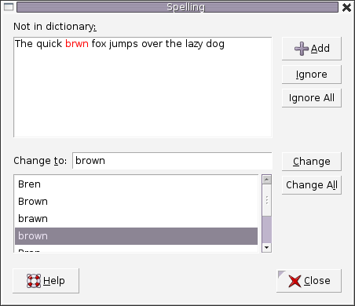

### 前缀树

`定义: 前缀树` ，又称 `字典树` ，是 `N 叉树` 的特殊形式。通常用于存储字符串。


> 注意根节点表示**空字符串**
>
> 前缀树的一个重要的特性: 节点所有的后代都与该节点相关的字符串有着共同的前缀。这就是 `前缀树` 名称的由来。

实际应用: 自动补全 拼写检查等

- 代码:

  - 数组

    ```java
    class TrieNode {
        // change this value to adapt to different cases
        public static final int N = 26; // Store 26 letters
        public TrieNode[] children = new TrieNode[N];
        
        // you might need some extra values according to different cases
    };
    
    /** Usage:
     *  Initialization: TrieNode root = new TrieNode();
     *  Return a specific child node with char c: root.children[c - 'a']
     */
    
    ```

    对于特定的字符c 可以使用 c - 'a' 作为**索引**来查找数组中的对应的子节点。

    ```java
    class Trie {
    
        class TrieNode {
            private boolean isEnd;
            TrieNode[] next;
    
            public TrieNode() {
                isEnd =false;
                next = new TrieNode[26];
            }
        }
    
        private TrieNode root;
    
        /** Initialize your data structure here. */
        public Trie() {
            root = new TrieNode();
        }
        
        /** Inserts a word into the trie. */
        public void insert(String word) {
            TrieNode node = root;
            for (char c : word.toCharArray()) {
                if (node.next[c - 'a'] == null) {
                    node.next[c - 'a'] = new TrieNode();
                }
                node = node.next[c - 'a'];
            }
            node.isEnd = true;
        }
        
        /** Returns if the word is in the trie. */
        public boolean search(String word) {
            TrieNode node = root;
            for (char c : word.toCharArray()) {
                node = node.next[c - 'a'];
                if (node == null) {
                    return false;
                }
            }
            return node.isEnd; // Judge is entire String ?
        }
        
        /** Returns if there is any word in the trie that starts with the given prefix. */
        public boolean startsWith(String prefix) {
            TrieNode node = root;
            for (char c : prefix.toCharArray()) {
                node  = node.next[c - 'a'];
                if (node == null) {
                    return false;
                }
            }
            return true; // Don't need judge the entire String 
        }
    }
    
    /**
     * Your Trie object will be instantiated and called as such:
     * Trie obj = new Trie();
     * obj.insert(word);
     * boolean param_2 = obj.search(word);
     * boolean param_3 = obj.startsWith(prefix);
     */
    ```

  - Map

    ```java
    class TrieNode {
        public Map<Character, TrieNode> children = new HashMap<>();
        
        // you might need some extra values according to different cases
    };
    
    /** Usage:
     *  Initialization: TrieNode root = new TrieNode();
     *  Return a specific child node with char c: root.children.get(c)
     */
    ```

    HashMap的键是字符 值是对应的子节点，不受固定的长度和范围的限制。

    > 注意: 有时候并不是每个节点都是有意义的，可以用以用一个boolean去判断是否是单词节点或者中间节点。

- 插入: 根据插入的目标值 决定路径

  ```java
  1. Initialize: cur = root
  2. for each char c in target string S:
  3. 		if cur does not have a child c:
  4.			cur.children[c] = new Trie node
  5.		cur = cur.children[c]
  6. cur is the node which represents the string S
  ```

  > 通常需要自己构建前缀树，实际上就是多次调用**插入函数**
  >
  > 注意: 在插入字符串之前要初始化很节点

- 搜索: 

  ```java
  1. Initialize: cur = root
  2. for each char c in target string S:
  3. 		if cur does not have a child c:
  4.			search fails
  5.		cur = cur.children[c]
  6. search successes
  ```

- 实际应用；

  - 自动补全

    

  - 拼写检查

    

    


