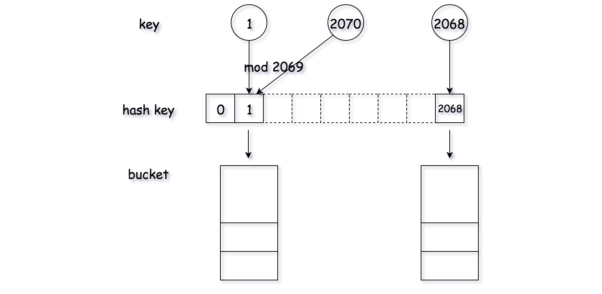

### 哈希表

- 哈希集合: ***集合类型*** 的实现 用于存储 ***非重复值***

- 哈希映射: ***映射类型*** 的实现 用于存储 ***(k,v) 键值对***

1. 哈希表的 **原理** 是什么？

   关键思想是使用***哈希函数*** ，将***键*** 映射到存储桶

   - 当我们插入一个新的键时，哈希函数将决定该键应该分配到哪个桶中，并将该键存储在相应的桶中；
   - 当我们想要搜索一个键时，哈希表将使用相同的哈希函数来查找对应的桶，并只在特定的桶中进行搜索。

   

   > 例如: 该哈希函数为y = x % 5

2. 如何 **设计** 哈希表？

   - 哈希函数

     用于将键映射到特定的桶中 散列函数取决于***键值的范围* **和***桶的数量***

     > 例如: y = x % 5 (x为键值 y为分配的桶的索引)

     

     哈希函数的设计思想: 尽可能的将键分配到桶中 (最理想情况是实现键和桶之间的一对一关系 但大多数情况下 需要权衡桶的数量和容量) 

   - 冲突

     1. 如何组织在同一个桶中的值？
     2. 如果为同一个桶分配了太多的值，该怎么办？
     3. 如何在特定的桶中搜索目标值？

     > 这些问题和**桶的数量** 和 可能映射到**同一个桶的键的数目**相关
     >
     > 如果 *N* 是常数且很小，我们可以简单地使用一个**数组**将键存储在同一个桶中。
     >
     > 如果 *N* 是可变的或很大，我们可能需要使用**高度平衡的二叉树**来代替.。

   - 设计顺序: 阅读需求 > 确定哈希函数 > 解决冲突

     - 哈希函数：目的是分配一个地址存储值。理想情况下，每个值都应该有一个对应唯一的散列值。

     - 冲突处理：哈希函数的**本质**就是**从 A 映射到 B**。但是**多个 A 值**可能映射到**相同的 B**。这就是**碰撞**。

       因此，我们需要有对应的策略来解决碰撞。总的来说，有以下几种策略解决冲突：

       1. 单独链接法：对于相同的散列值，我们将它们放到一个桶中，每个桶是相互独立的。

          > 从本质上讲，HashSet 的存储空间相当于**连续内存数组**。这个数组中的**每个元素**相当于一个**桶**。
          > 给定一个**值**，我们首先通过**哈希函数**生成对应的散列值来**定位桶**的位置。
          > 一旦**找到桶**的位置，则在该桶上做相对应的**操作**，如 add，remove，contains。

          哈希函数的共同特点是使用**模运算符**。

          **hash = value mod  base**   其中，base 将决定 HashSet 中的桶数。

          从理论上讲，桶越多（因此空间会越大）越不太可能发生碰撞。base 的选择是**空间和碰撞**之间的权衡。

          此外，使用质数作为 base 是一个明智的选择。可以减少潜在的碰撞 .

          选择链表来存储桶的所有值是更好的选择，插入和删除具有常数的时间复杂度O(1)(而不是数组 因为添加和删除的时候会达到O(N))

          ***设计哈希集合***

          ```java
          /**
          	算法：
          	正如我们在上面讨论的，这里将采用 LinkedList 实现 HashSet 中的桶。
          	对于每个功能 add，remove，contains，我们首先生成桶的散列值，操作相对应的桶。
          */
          class MyHashSet {
            private Bucket[] bucketArray;
            private int keyRange;
          
            /** Initialize your data structure here. */
            public MyHashSet() {
              this.keyRange = 769;
              this.bucketArray = new Bucket[this.keyRange];
              for (int i = 0; i < this.keyRange; ++i)
                this.bucketArray[i] = new Bucket();
            }
          
            protected int _hash(int key) {
              return (key % this.keyRange);
            }
          
            public void add(int key) {
              int bucketIndex = this._hash(key);
              this.bucketArray[bucketIndex].insert(key);
            }
          
            public void remove(int key) {
              int bucketIndex = this._hash(key);
              this.bucketArray[bucketIndex].delete(key);
            }
          
            /** Returns true if this set contains the specified element */
            public boolean contains(int key) {
              int bucketIndex = this._hash(key);
              return this.bucketArray[bucketIndex].exists(key);
            }
          }
          
          
          class Bucket {
            private LinkedList<Integer> container;
          
            public Bucket() {
              container = new LinkedList<Integer>();
            }
          
            public void insert(Integer key) {
              int index = this.container.indexOf(key);
              if (index == -1) {
                this.container.addFirst(key);
              }
            }
          
            public void delete(Integer key) {
              this.container.remove(key);
            }
          
            public boolean exists(Integer key) {
              int index = this.container.indexOf(key);
              return (index != -1);
            }
          }
          
          /**
           * Your MyHashSet object will be instantiated and called as such:
           * MyHashSet obj = new MyHashSet();
           * obj.add(key);
           * obj.remove(key);
           * boolean param_3 = obj.contains(key);
           */
          
          /**
          
          复杂度分析
          
              时间复杂度：O(NK)\mathcal{O}(\frac{N}{K})O(KN​)。其中 NNN 指的是所有可能值数量，KKK 指的是预定义的桶数，也就是 769。
                  1.假设值是平均分布的，因此可以考虑桶的平均大小是 NK\frac{N}{K}KN​。
                  2.对于每个操作，在最坏的情况下，我们需要扫描整个桶，因此时间复杂度是O(NK)\mathcal{O}(\frac{N}{K})O(KN​)。
                  
              空间复杂度：O(K+M)\mathcal{O}(K+M)O(K+M)，其中 KKK 指的是预定义的桶数，MMM 指的是已经插入到 HashSet 中值的数量。
          
          */
          ```

          ***设计哈希映射***

          > 1). 如何设计哈希方法？：哈希方法会将键值映射到某块存储空间，一个好的哈希方法应该将不同的键值 均匀 地分布在存储空间中。
          >
          > 2). 如何避免哈希碰撞？：哈希方法要将大量的键值映射到一个有限的空间里,这样就有可能会将不同的键值映射到同一个存储空间，这种情况称为 '哈希碰撞' 。哈希碰撞是不可避免的，但可以用策略来解决哈希碰撞。
          >
          > 
          >
          > 思路
          >
          > 最简单的思路就是用模运算作为哈希方法，为了降低哈希碰撞的概率，通常取素数的模，例如 模 2069。
          >
          > 定义 array 数组作为存储空间，通过哈希方法计算数组下标。为了解决 哈希碰撞 （即键值不同，但映射下标相同），利用 桶 来存储所有对应的数值。桶可以用 数组 或 链表 来实现，在下面的具体实现中， Python 中用的是 数组，Java 中用的是 链表。
          >
          > 
          >
          > 算法
          >
          > 定义哈希表方法，get()，put() 和 remove()，其中的寻址过程如下所示：
          >
          > 对于一个给定的 键值，利用哈希方法生成键值的哈希码，利用哈希码定位存储空间。对于每个哈希码，都能找到一个 桶 来存储该键值所对应的数值。
          >
          > 在找到一个桶之后，通过遍历来检查该 键值 对是否已经存在。

          

          

          ```java
          class Pair<U, V> {
              public U first;
              public V second;
            
              public Pair(U first, V second) {
                this.first = first;
                this.second = second;
              }
          }
            
            class Bucket {
              private List<Pair<Integer, Integer>> bucket;
            
              public Bucket() {
                this.bucket = new LinkedList<Pair<Integer, Integer>>();
              }
            
              public Integer get(Integer key) {
                for (Pair<Integer, Integer> pair : this.bucket) {
                  if (pair.first.equals(key))
                    return pair.second;
                }
                return -1;
              }
            
              public void update(Integer key, Integer value) {
                boolean found = false;
                for (Pair<Integer, Integer> pair : this.bucket) {
                  if (pair.first.equals(key)) {
                    pair.second = value;
                    found = true;
                  }
                }
                if (!found)
                  this.bucket.add(new Pair<Integer, Integer>(key, value));
              }
            
              public void remove(Integer key) {
                for (Pair<Integer, Integer> pair : this.bucket) {
                  if (pair.first.equals(key)) {
                    this.bucket.remove(pair);
                    break;
                  }
                }
              }
            }
            
            class MyHashMap {
              private int key_space;
              private List<Bucket> hash_table;
            
              /** Initialize your data structure here. */
              public MyHashMap() {
                this.key_space = 2069;
                this.hash_table = new ArrayList<Bucket>();
                for (int i = 0; i < this.key_space; ++i) {
                  this.hash_table.add(new Bucket());
                }
              }
            
              /** value will always be non-negative. */
              public void put(int key, int value) {
                int hash_key = key % this.key_space;
                this.hash_table.get(hash_key).update(key, value);
              }
            
              /**
               * Returns the value to which the specified key is mapped, or -1 if this map contains no mapping
               * for the key
               */
              public int get(int key) {
                int hash_key = key % this.key_space;
                return this.hash_table.get(hash_key).get(key);
              }
            
              /** Removes the mapping of the specified value key if this map contains a mapping for the key */
              public void remove(int key) {
                int hash_key = key % this.key_space;
                this.hash_table.get(hash_key).remove(key);
              }
            }
            
            /**
             * Your MyHashMap object will be instantiated and called as such: MyHashMap obj = new MyHashMap();
             * obj.put(key,value); int param_2 = obj.get(key); obj.remove(key);
             */
          ```

          > 复杂度
          >
          > 时间复杂度：每个方法的时间复杂度都为 O(NK)O(\frac{N}{K})O(KN)，其中 NNN 为所有可能键值的数量，KKK 为哈希表中预定义桶的数量，在这里 KKK 为 2069。这里我们假设键值是均匀地分布在所有桶中的，桶的平均大小为 NK\frac{N}{K}KN，在最坏情况下需要遍历完整个桶，因此时间复杂度为 O(NK)O(\frac{N}{K})O(KN)。
          >
          > 空间复杂度：O(K+M)O(K+M)O(K+M)，其中 KKK 为哈希表中预定义桶的数量，MMM 为哈希表中已插入键值的数量。

       2. 开放地址法：每当有碰撞， 则根据我们探查的策略找到一个空的槽为止。

       3. 双散列法：使用两个哈希函数计算散列值，选择碰撞更少的地址

       

   - 设计哈系表

     这里给出 C++ 和 Java 的解决方案供您参考。在我们的解决方案中，我们使用一个数组来表示哈希集。数组中的每个元素都是一个桶。在每个桶中，我们使用数组列表 array list（或 C++ 中的向量 vector）来存储所有值。

   - 复杂度设计

     如果总共有 M 个键，那么在使用哈希表时，可以很容易地达到 O(M) 的空间复杂度。

     但是，你可能已经注意到哈希表的时间复杂度与设计有很强的关系。

     我们中的大多数人可能已经在每个桶中使用数组来将值存储在同一个桶中，理想情况下，桶的大小足够小时，可以看作是一个常数。插入和搜索的时间复杂度都是 O(1)。

     但在最坏的情况下，桶大小的最大值将为 N。插入时时间复杂度为 O(1)，搜索时为 O(N)。


- 实际应用-哈希集合

  **哈希集** 是集合的实现之一，它是一种存储**不重复值**的数据结构。

  ```java
  // "static void main" must be defined in a public class.
  public class Main {
      public static void main(String[] args) {
          // 1. initialize the hash set
          Set<Integer> hashSet = new HashSet<>();     
          // 2. add a new key
          hashSet.add(3);
          hashSet.add(2);
          hashSet.add(1);
          // 3. remove the key
          hashSet.remove(2);        
          // 4. check if the key is in the hash set
          if (!hashSet.contains(2)) {
              System.out.println("Key 2 is not in the hash set.");
          }
          // 5. get the size of the hash set
          System.out.println("The size of has set is: " + hashSet.size());     
          // 6. iterate the hash set
          for (Integer i : hashSet) {
              System.out.print(i + " ");
          }
          System.out.println("are in the hash set.");
          // 7. clear the hash set
          hashSet.clear();
          // 8. check if the hash set is empty
          if (hashSet.isEmpty()) {
              System.out.println("hash set is empty now!");
          }
      }
  }
  ```


Note:

​		集合 set 这一数据结构，可以提供平均时间复杂度为 O(1) 的 ***in/contains*** 操作（用于测试某一元素是否为该集合的成员）。

​		可将两个数组都转换为集合，然后***迭代较小***的集合，检查其中的每个元素是否同样存在于较大的集合中。平均情况下，这种方法的时间复杂度为 ***O(n+m)*** 。

> num1 = [1, 2, 3]    num2 = [1, 1, 3, 4]
>
> set1 = (1, 2, 3)       set2  = (1, 3, 4)  (会把重复的元素去掉)
>
> output = [1, 3]

 

**Arrays.copyOf() 方法对于基本数据类型来说是深拷贝，对引用类型来说是浅拷贝。**

> 主要用于 返回特定长度的数组 防止出现额外的0  (对比于直接返回一个数组 数组的长度可能过长)
>
> int[] num = new int[set.size()]; // 假设长度为3
>
> int idx = 0; 
>
> ......
>
> idx ++; // idx = 2
>
> 
>
> return Arrays,copyOf(num, idx) // [1, 2]  正确的结果
>
> return num; // [1, 2, 0]  对出一个0

 

HashSet<> 还可以用于检查是否存在环

```java
public boolean isHappy(int n) {
        Set<Integer> set = new HashSet<Integer>();  // check for circle ?
		while(n != 1 && !set.contains(n)){
			// if has circle then drop while return n (n not equal 1 so return false)
			set.add(n);
			n = getNext(n);
		}
		return n == 1;
	}
```


- 实际应用-哈希映射

用于存储(key, value) 键值对的一种实现

```java
// "static void main" must be defined in a public class.
public class Main {
    public static void main(String[] args) {
        // 1. initialize a hash map
        Map<Integer, Integer> hashmap = new HashMap<>();
        // 2. insert a new (key, value) pair
        hashmap.putIfAbsent(0, 0);
        hashmap.putIfAbsent(2, 3);
        // 3. insert a new (key, value) pair or update the value of existed key
        hashmap.put(1, 1);
        hashmap.put(1, 2);
        // 4. get the value of specific key
        System.out.println("The value of key 1 is: " + hashmap.get(1));
        // 5. delete a key
        hashmap.remove(2);
        // 6. check if a key is in the hash map
        if (!hashmap.containsKey(2)) {
            System.out.println("Key 2 is not in the hash map.");
        }
        // 7. get the size of the hash map
        System.out.println("The size of hash map is: " + hashmap.size()); 
        // 8. iterate the hash map
        for (Map.Entry<Integer, Integer> entry : hashmap.entrySet()) {
            System.out.print("(" + entry.getKey() + "," + entry.getValue() + ") ");
        }
        System.out.println("are in the hash map.");
        // 9. clear the hash map
        hashmap.clear();
        // 10. check if the hash map is empty
        if (hashmap.isEmpty()) {
            System.out.println("hash map is empty now!");
        }
    }
}
```


同构问题 ---> 一一映射问题 ---> 哈希映射

```java
HashMap<> hashmap = new HashMap<>();
for(int i = 0; i < s.length(); i++){
    char c1 = s.charAt(i);
    char c2 = t.charAt(i);
    if(hashmap.containsKey(c1)){
        if(hashmap.get(c1) != c2){ 
            // 判断是否是一一映射
            return false;
        }
    }else {
        hashmap.put(c1, c2);
    }
}
return true;
```

将链表转换为数组

```java
List<String> list = new ArrayList<>();
list.add("123");
list.add("456");
int len = list.size(); // 链表长度的求法
return list; // 返回值是链表

String[] res = list.toArray(new String[list.size()]);
int len = res.length; // 数组长度的求法
return res; // 返回的是数组
```


- 实际应用-设计键


3. 如何使用 哈希集 来解决**与重复相关**的问题？

4. 如何使用 哈希映射 **按键聚合信息**？

5. 如何在使用哈希表时 **设计正确的键** ？


