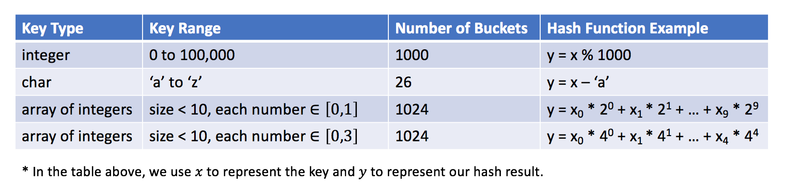

### 哈希表

- 哈希集合: ***集合类型*** 的实现 用于存储 ***非重复值***

- 哈希映射: ***映射类型*** 的实现 用于存储 ***(k,v) 键值对***

1. 哈希表的 **原理** 是什么？

   关键思想是使用***哈希函数*** ，将***键*** 映射到存储桶

   - 当我们插入一个新的键时，哈希函数将决定该键应该分配到哪个桶中，并将该键存储在相应的桶中；
   - 当我们想要搜索一个键时，哈希表将使用相同的哈希函数来查找对应的桶，并只在特定的桶中进行搜索。

   

   > 例如: 该哈希函数为y = x % 5

2. 如何 **设计** 哈希表？

   - 哈希函数

     用于将键映射到特定的桶中 散列函数取决于***键值的范围* **和***桶的数量***

     > 例如: y = x % 5 (x为键值 y为分配的桶的索引)

     

     哈希函数的设计思想: 尽可能的将键分配到桶中 (最理想情况是实现键和桶之间的一对一关系 但大多数情况下 需要权衡桶的数量和容量) 

   - 冲突

     1. 如何组织在同一个桶中的值？
     2. 如果为同一个桶分配了太多的值，该怎么办？
     3. 如何在特定的桶中搜索目标值？

     > 这些问题和**桶的数量** 和 可能映射到**同一个桶的键的数目**相关
     >
     > 如果 *N* 是常数且很小，我们可以简单地使用一个**数组**将键存储在同一个桶中。
     >
     > 如果 *N* 是可变的或很大，我们可能需要使用**高度平衡的二叉树**来代替.。

   - 设计顺序: 阅读需求 > 确定哈希函数 > 解决冲突

     - 哈希函数：目的是分配一个地址存储值。理想情况下，每个值都应该有一个对应唯一的散列值。

     - 冲突处理：哈希函数的**本质**就是**从 A 映射到 B**。但是**多个 A 值**可能映射到**相同的 B**。这就是**碰撞**。

       因此，我们需要有对应的策略来解决碰撞。总的来说，有以下几种策略解决冲突：

       1. 单独链接法：对于相同的散列值，我们将它们放到一个桶中，每个桶是相互独立的。

          > 从本质上讲，HashSet 的存储空间相当于**连续内存数组**。这个数组中的**每个元素**相当于一个**桶**。
          > 给定一个**值**，我们首先通过**哈希函数**生成对应的散列值来**定位桶**的位置。
          > 一旦**找到桶**的位置，则在该桶上做相对应的**操作**，如 add，remove，contains。

          哈希函数的共同特点是使用**模运算符**。

          **hash = value mod  base**   其中，base 将决定 HashSet 中的桶数。

          从理论上讲，桶越多（因此空间会越大）越不太可能发生碰撞。base 的选择是**空间和碰撞**之间的权衡。

          此外，使用质数作为 base 是一个明智的选择。可以减少潜在的碰撞 .

          选择链表来存储桶的所有值是更好的选择，插入和删除具有常数的时间复杂度O(1)(而不是数组 因为添加和删除的时候会达到O(N))

          ***设计哈希集合***

          ```java
          /**
          	算法：
          	正如我们在上面讨论的，这里将采用 LinkedList 实现 HashSet 中的桶。
          	对于每个功能 add，remove，contains，我们首先生成桶的散列值，操作相对应的桶。
          */
          class MyHashSet {
            private Bucket[] bucketArray;
            private int keyRange;
          
            /** Initialize your data structure here. */
            public MyHashSet() {
              this.keyRange = 769;
              this.bucketArray = new Bucket[this.keyRange];
              for (int i = 0; i < this.keyRange; ++i)
                this.bucketArray[i] = new Bucket();
            }
          
            protected int _hash(int key) {
              return (key % this.keyRange);
            }
          
            public void add(int key) {
              int bucketIndex = this._hash(key);
              this.bucketArray[bucketIndex].insert(key);
            }
          
            public void remove(int key) {
              int bucketIndex = this._hash(key);
              this.bucketArray[bucketIndex].delete(key);
            }
          
            /** Returns true if this set contains the specified element */
            public boolean contains(int key) {
              int bucketIndex = this._hash(key);
              return this.bucketArray[bucketIndex].exists(key);
            }
          }
          
          
          class Bucket {
            private LinkedList<Integer> container;
          
            public Bucket() {
              container = new LinkedList<Integer>();
            }
          
            public void insert(Integer key) {
              int index = this.container.indexOf(key);
              if (index == -1) {
                this.container.addFirst(key);
              }
            }
          
            public void delete(Integer key) {
              this.container.remove(key);
            }
          
            public boolean exists(Integer key) {
              int index = this.container.indexOf(key);
              return (index != -1);
            }
          }
          
          /**
           * Your MyHashSet object will be instantiated and called as such:
           * MyHashSet obj = new MyHashSet();
           * obj.add(key);
           * obj.remove(key);
           * boolean param_3 = obj.contains(key);
           */
          
          /**
          
          复杂度分析
          
              时间复杂度：O(NK)\mathcal{O}(\frac{N}{K})O(KN​)。其中 NNN 指的是所有可能值数量，KKK 指的是预定义的桶数，也就是 769。
                  1.假设值是平均分布的，因此可以考虑桶的平均大小是 NK\frac{N}{K}KN​。
                  2.对于每个操作，在最坏的情况下，我们需要扫描整个桶，因此时间复杂度是O(NK)\mathcal{O}(\frac{N}{K})O(KN​)。
                  
              空间复杂度：O(K+M)\mathcal{O}(K+M)O(K+M)，其中 KKK 指的是预定义的桶数，MMM 指的是已经插入到 HashSet 中值的数量。
          
          */
          ```

       2. 开放地址法：每当有碰撞， 则根据我们探查的策略找到一个空的槽为止。

       3. 双散列法：使用两个哈希函数计算散列值，选择碰撞更少的地址

     

3. 如何使用 哈希集 来解决**与重复相关**的问题？

4. 如何使用 哈希映射 **按键聚合信息**？

5. 如何在使用哈希表时 **设计正确的键** ？


