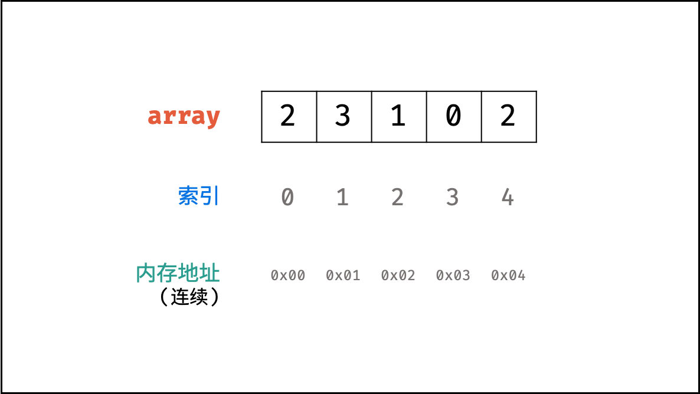
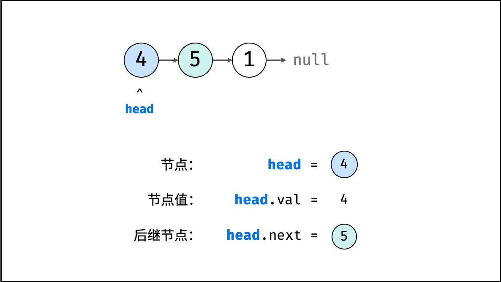
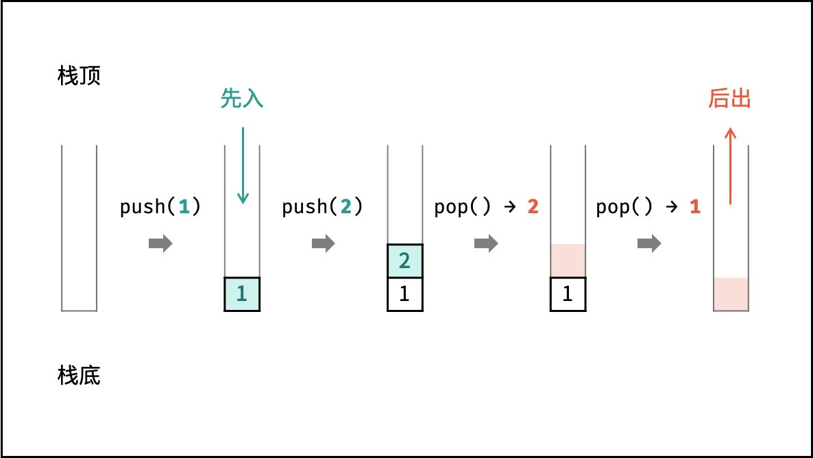
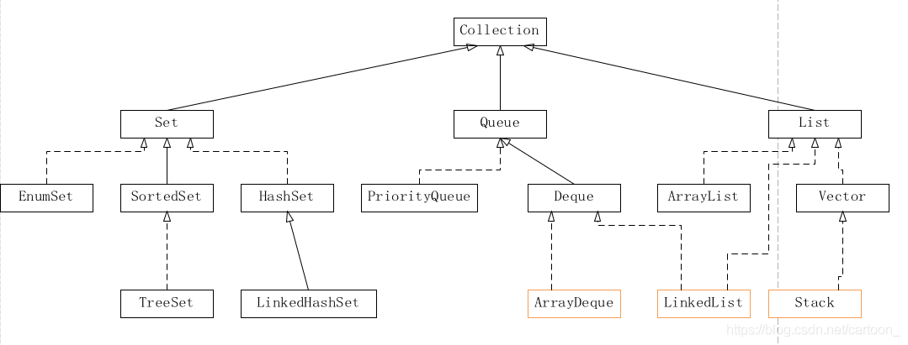
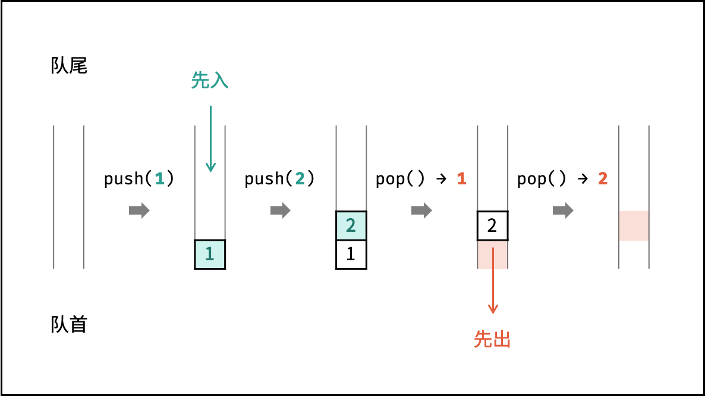

### 图解算法

- 数据结构

  

  - 数组

    数组是将**相同类型**的元素存储于**连续**内存空间的数据结构，其长度**不可变**。

    

    

    可变数组: 经常使用的数据结构, 基于**数组**和**扩容机制**实现，可以进行访问元素、添加元素、删除元素的操作。

    ```java
    List<Integer> array = new ArrayList<>(); // 初始化可变数组
    ```

    

  - 链表

    链表以**节点**为单位，每个元素都是一个**独立对象**，在内存空间的存储是**非连续**的。链表的节点对象具有两个成员变量：「**值** `val`」，「**后继节点引用** `next`」 。

    ```java
    class ListNode {
        int val;       // 节点值
        ListNode next; // 后继节点引用
        ListNode(int x) { 
            val = x; 
        }
    }
    ```

    建立此链表需要**实例化**每个节点，并构建各节点的引用指向。

    ```java
    // 实例化节点
    ListNode n1 = new ListNode(1); // 头节点 head
    ListNode n2 = new ListNode(2);
    // 构建引用指向
    n1.next = n2;
    ```

    

  - 栈

    **『先进后出』** 可使用**数组**或者**链表**实现。(多用LinkedList<>())

    ```java
    Stack<Integer> stack = new Stack<>();
    ```

    操作: 入栈 push() 、出栈 pop() 

    ```java
    stack.push(1); // 元素 1 入栈
    stack.push(2); // 元素 2 入栈
    stack.pop();   // 出栈 -> 元素 2
    stack.pop();   // 出栈 -> 元素 1
    ```

    

    > 注意：通常情况下，不推荐使用 Java 的 Vector 以及其子类 Stack ，而一般将 LinkedList 作为栈来使用。详细说明请见：[Stack，ArrayDeque，LinkedList 的区别](https://blog.csdn.net/cartoon_/article/details/87992743) 。
    >
    > 

    ```java
    LinkedList<Integer> stack = new LinkedList<>();
    
    stack.addLast(1);   // 元素 1 入栈
    stack.addLast(2);   // 元素 2 入栈
    stack.removeLast(); // 出栈 -> 元素 2
    stack.removeLast(); // 出栈 -> 元素 1
    ```

    

  - 队列

    **『先进先出』** 可使用**链表**实现。(多用 LinkedList<>())

    ```java
    Queue<Integer> queue = new LinkedList<>();
    ```

    操作: 入队 push() 出队 pop()

    ```java
    queue.offer(1); // 元素 1 入队
    queue.offer(2); // 元素 2 入队
    queue.poll();   // 出队 -> 元素 1
    queue.poll();   // 出队 -> 元素 2
    ```

    

    

  - 树

    

  - 图

  - 

- 动态规划

- 搜索与回溯算法

- 分治算法

- 排序

- 查找算法

- 双指针

- 位运算

- 数学


- 模拟

  