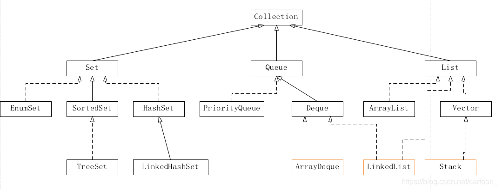

### 图解算法

- 数据结构

  

  - 数组

    数组是将**相同类型**的元素存储于**连续**内存空间的数据结构，其长度**不可变**。

    

    

    可变数组: 经常使用的数据结构, 基于**数组**和**扩容机制**实现，可以进行访问元素、添加元素、删除元素的操作。

    ```java
    List<Integer> array = new ArrayList<>(); // 初始化可变数组
    ```

    

  - 链表

    链表以**节点**为单位，每个元素都是一个**独立对象**，在内存空间的存储是**非连续**的。链表的节点对象具有两个成员变量：「**值** `val`」，「**后继节点引用** `next`」 。

    ```java
    class ListNode {
        int val;       // 节点值
        ListNode next; // 后继节点引用
        ListNode(int x) { 
            val = x; 
        }
    }
    ```

    建立此链表需要**实例化**每个节点，并构建各节点的引用指向。

    ```java
    // 实例化节点
    ListNode n1 = new ListNode(1); // 头节点 head
    ListNode n2 = new ListNode(2);
    // 构建引用指向
    n1.next = n2;
    ```

    

  - 栈

    **『先进后出』** 可使用**数组**或者**链表**实现。(多用LinkedList<>())

    ```java
    Stack<Integer> stack = new Stack<>();
    ```

    操作: 入栈 push() 、出栈 pop() 

    ```java
    stack.push(1); // 元素 1 入栈
    stack.push(2); // 元素 2 入栈
    stack.pop();   // 出栈 -> 元素 2
    stack.pop();   // 出栈 -> 元素 1
    ```

    

    > 注意：通常情况下，不推荐使用 Java 的 Vector 以及其子类 Stack ，而一般将 LinkedList 作为栈来使用。详细说明请见：[Stack，ArrayDeque，LinkedList 的区别](https://blog.csdn.net/cartoon_/article/details/87992743) 。
    >
    > 

    ```java
    LinkedList<Integer> stack = new LinkedList<>();
    
    stack.addLast(1);   // 元素 1 入栈
    stack.addLast(2);   // 元素 2 入栈
    stack.removeLast(); // 出栈 -> 元素 2
    stack.removeLast(); // 出栈 -> 元素 1
    ```

    

  - 队列

    **『先进先出』** 可使用**链表**实现。(多用 LinkedList<>())

    ```java
    Queue<Integer> queue = new LinkedList<>();
    ```

    操作: 入队 push() 出队 pop()

    ```java
    queue.offer(1); // 元素 1 入队
    queue.offer(2); // 元素 2 入队
    queue.poll();   // 出队 -> 元素 1
    queue.poll();   // 出队 -> 元素 2
    ```

    

    用两个栈实现队列

    ```java
    package com.abel;
    
    import java.util.ArrayList;
    import java.util.Stack;
    
    class CQueue {
    
        Stack<Integer> s1, s2; // 定义局部变量
        public CQueue() {
            // 初始化两个栈
            s1 = new Stack<>();
            s2 = new Stack<>();
        }
    
        public void appendTail(int value) {
            s1.push(value);
    //        System.out.println("appendTail :" + s1);
        }
    
        public int deleteHead() {
            if (! s2.isEmpty()) { return s2.pop(); }
            if (s1.isEmpty()) return -1;
            while (! s1.isEmpty()) {
                s2.push(s1.pop());
            }
    //        System.out.println("deleteHead: " + s2.pop());
            return s2.pop();
        }
    
    //    public static void main(String[] args) {
    //        CQueue queue = new CQueue();
    //        queue.appendTail(1);
    //        queue.appendTail(2);
    //        queue.appendTail(3);
    //        queue.deleteHead();
    //    }
    }
    
    /**
     * Your CQueue object will be instantiated and called as such:
     * CQueue obj = new CQueue();
     * obj.appendTail(value);
     * int param_2 = obj.deleteHead();
     */
    ```

    

  - 树

    非线性数据结构

    ```java
    class TreeNode {
        int val;        // 节点值
        TreeNode left;  // 左子节点
        TreeNode right; // 右子节点
        TreeNode(int x) { val = x; }
    }
    ```

    ```java
    // 初始化节点
    TreeNode n1 = new TreeNode(3); // 根节点 root
    TreeNode n2 = new TreeNode(4);
    TreeNode n3 = new TreeNode(5);
    TreeNode n4 = new TreeNode(1);
    TreeNode n5 = new TreeNode(2);
    
    // 构建引用指向
    n1.left = n2;
    n1.right = n3;
    n2.left = n4;
    n2.right = n5;
    ```

    

  - 图

    非线性数据结构，由「**节点**（顶点）`vertex`」和「**边** `edge`」组成，每条边连接**一对顶点**。根据边的方向有无，图可分为「**有向图**」和「**无向图**」。

    

    - 顶点集合： vertices = {1, 2, 3, 4, 5}
    - 边集合： edges = {(1, 2), (1, 3), (1, 4), (1, 5), (2, 4), (3, 5), (4, 5)}

  - 散列表 <key, value>

    非线性数据结构，通过利用 **Hash 函数**将指定的「**键 `key`」**映射至对应的**「值 `value`」**，以实现高效的元素查找。

    > 根据 ''姓名key'' 查找 ''学号value''

    ```java
    // 初始化散列表
    Map<String, Integer> dic = new HashMap<>();
    
    // 添加 key -> value 键值对
    dic.put("小力", 10001);
    dic.put("小特", 10002);
    dic.put("小扣", 10003);
    
    // 从姓名查找学号
    dic.get("小力"); // -> 10001
    dic.get("小特"); // -> 10002
    dic.get("小扣"); // -> 10003
    ```

    

    自行设计Hash函数

    > 从 “学号” 查找 “姓名”

    ```java
    String[] names = { "小力", "小特", "小扣" }; // 索引为0 2 3
    ```

    构造简单的hash函数: ***hash(key)=(key−1)%10000***

    ```java
    int hash(int id) {
        int index = (id - 1) % 10000;
        return index;
    }
    ```

    构建了以学号为 key 、姓名对应的数组索引为 value 的散列表。利用此 Hash 函数，则可在 **O(1)** 时间复杂度下通过学号查找到对应姓名，即：

    ```java
    names[hash(10001)] // 小力
    names[hash(10002)] // 小特
    names[hash(10003)] // 小扣
    ```

    

    > hash 函数需保证低碰撞率、 高鲁棒性等，以适用于各类数据和场景。

  - 堆

    基于 **完全二叉树** 的数据结构(可通过数组实现)。

    以堆为原理的排序算法称为**「堆排序」**，基于堆实现的数据结构为**「优先队列」**。

    堆分为「大顶堆」和「小顶堆」，大（小）顶堆：**任意节点**的值不大于（小于）其**父节点**的值。

    > 完全二叉树定义： 设二叉树深度为 kk ，若二叉树除第 kk 层外的其它各层（第 11 至 k-1k−1 层）的节点达到最大个数，且处于第 kk 层的节点都连续集中在最左边，则称此二叉树为完全二叉树。
    >
    > 

    

    如下图所示，为包含 `1, 4, 2, 6, 8` 元素的小顶堆。将堆（完全二叉树）中的结点**按层编号**，即可映射到右边的数组存储形式。

    

    通过使用「优先队列」的「压入 `push()`」和「弹出 `pop()`」操作，即可完成堆排序，实现代码如下：

    ```java
    // 初始化小顶堆
    Queue<Integer> heap = new PriorityQueue<>();
    
    // 元素入堆
    heap.add(1);
    heap.add(4);
    heap.add(2);
    heap.add(6);
    heap.add(8);
    
    // 元素出堆（从小到大）
    heap.poll(); // -> 1
    heap.poll(); // -> 2
    heap.poll(); // -> 4
    heap.poll(); // -> 6
    heap.poll(); // -> 8
    ```

  

  - Others: 

    1. 如果返回类型是String的，还需要切片，可以直接返回 return (同时效率也是最高的)

       ```java
       return s.substring(n, s.length()) + s.substring(0, n); // substring() 是左闭右开的
       ```

       如果不让用substring()内置函数

       ```java
       class Solution {
           public String reverseLeftWords(String s, int n) {
               StringBuilder res = new StringBuilder(); // 用StringBuilder(效率一般) 或者使用String res = "" (效率最低);
               for(int i = n; i < s.length(); i++)
                   res.append(s.charAt(i)); // charAt() 取对应下标的元素  res += s.charAt(i);
               for(int i = 0; i < n; i++)
                   res.append(s.charAt(i));
               return res.toString();
           }
       }
       ```

       取模更简单哦~ (推荐)

       ```java
       class Solution {
           public String reverseLeftWords(String s, int n) {
               StringBuilder res = new StringBuilder();
               for(int i = n; i < n + s.length(); i++)
                   res.append(s.charAt(i % s.length()));
               return res.toString();
           }
       }
       ```

       

    2. a

    3. 

    

    

- 动态规划

- 搜索与回溯算法

- 分治算法

- 排序

- 查找算法

- 双指针

- 位运算

- 数学


- 模拟

  