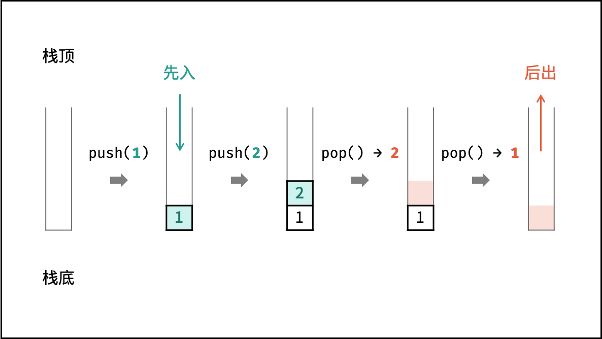
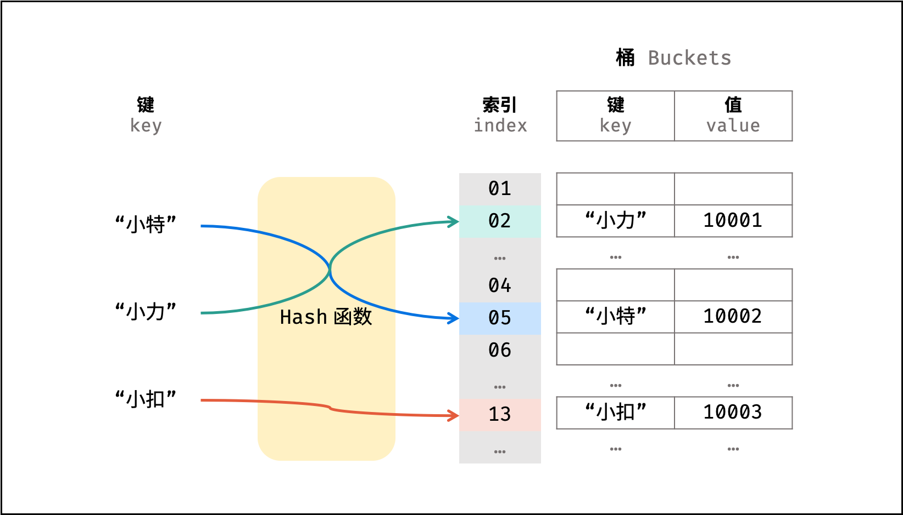

### 图解算法

- 数据结构

  

  - 数组

    数组是将**相同类型**的元素存储于**连续**内存空间的数据结构，其长度**不可变**。

    

    

    可变数组: 经常使用的数据结构, 基于**数组**和**扩容机制**实现，可以进行访问元素、添加元素、删除元素的操作。

    ```java
    List<Integer> array = new ArrayList<>(); // 初始化可变数组
    ```

    

  - 链表

    链表以**节点**为单位，每个元素都是一个**独立对象**，在内存空间的存储是**非连续**的。链表的节点对象具有两个成员变量：「**值** `val`」，「**后继节点引用** `next`」 。

    ```java
    class ListNode {
        int val;       // 节点值
        ListNode next; // 后继节点引用
        ListNode(int x) { 
            val = x; 
        }
    }
    ```

    建立此链表需要**实例化**每个节点，并构建各节点的引用指向。

    ```java
    // 实例化节点
    ListNode n1 = new ListNode(1); // 头节点 head
    ListNode n2 = new ListNode(2);
    // 构建引用指向
    n1.next = n2;
    ```

    

  - 栈

    **『先进后出』** 可使用**数组**或者**链表**实现。(多用LinkedList<>())

    ```java
    Stack<Integer> stack = new Stack<>();
    ```

    操作: 入栈 push() 、出栈 pop() 

    ```java
    stack.push(1); // 元素 1 入栈
    stack.push(2); // 元素 2 入栈
    stack.pop();   // 出栈 -> 元素 2
    stack.pop();   // 出栈 -> 元素 1
    ```

    

    > 注意：通常情况下，不推荐使用 Java 的 Vector 以及其子类 Stack ，而一般将 LinkedList 作为栈来使用。详细说明请见：[Stack，ArrayDeque，LinkedList 的区别](https://blog.csdn.net/cartoon_/article/details/87992743) 。
    >
    > 

    ```java
    LinkedList<Integer> stack = new LinkedList<>();
    
    stack.addLast(1);   // 元素 1 入栈
    stack.addLast(2);   // 元素 2 入栈
    stack.removeLast(); // 出栈 -> 元素 2
    stack.removeLast(); // 出栈 -> 元素 1
    ```

    

  - 队列

    **『先进先出』** 可使用**链表**实现。(多用 LinkedList<>())

    ```java
    Queue<Integer> queue = new LinkedList<>();
    ```

    操作: 入队 push() 出队 pop()

    ```java
    queue.offer(1); // 元素 1 入队
    queue.offer(2); // 元素 2 入队
    queue.poll();   // 出队 -> 元素 1
    queue.poll();   // 出队 -> 元素 2
    ```

    

    用两个栈实现队列

    ```java
    package com.abel;
    
    import java.util.ArrayList;
    import java.util.Stack;
    
    class CQueue {
    
        Stack<Integer> s1, s2; // 定义局部变量
        public CQueue() {
            // 初始化两个栈
            s1 = new Stack<>();
            s2 = new Stack<>();
        }
    
        public void appendTail(int value) {
            s1.push(value);
    //        System.out.println("appendTail :" + s1);
        }
    
        public int deleteHead() {
            if (! s2.isEmpty()) { return s2.pop(); }
            if (s1.isEmpty()) return -1;
            while (! s1.isEmpty()) {
                s2.push(s1.pop());
            }
    //        System.out.println("deleteHead: " + s2.pop());
            return s2.pop();
        }
    
    //    public static void main(String[] args) {
    //        CQueue queue = new CQueue();
    //        queue.appendTail(1);
    //        queue.appendTail(2);
    //        queue.appendTail(3);
    //        queue.deleteHead();
    //    }
    }
    
    /**
     * Your CQueue object will be instantiated and called as such:
     * CQueue obj = new CQueue();
     * obj.appendTail(value);
     * int param_2 = obj.deleteHead();
     */
    ```

    

  - 树

    非线性数据结构

    ```java
    class TreeNode {
        int val;        // 节点值
        TreeNode left;  // 左子节点
        TreeNode right; // 右子节点
        TreeNode(int x) { val = x; }
    }
    ```

    ```java
    // 初始化节点
    TreeNode n1 = new TreeNode(3); // 根节点 root
    TreeNode n2 = new TreeNode(4);
    TreeNode n3 = new TreeNode(5);
    TreeNode n4 = new TreeNode(1);
    TreeNode n5 = new TreeNode(2);
    
    // 构建引用指向
    n1.left = n2;
    n1.right = n3;
    n2.left = n4;
    n2.right = n5;
    ```

    

  - 图

    非线性数据结构，由「**节点**（顶点）`vertex`」和「**边** `edge`」组成，每条边连接**一对顶点**。根据边的方向有无，图可分为「**有向图**」和「**无向图**」。

    

    - 顶点集合： vertices = {1, 2, 3, 4, 5}
    - 边集合： edges = {(1, 2), (1, 3), (1, 4), (1, 5), (2, 4), (3, 5), (4, 5)}

  - 散列表 <key, value>

    非线性数据结构，通过利用 **Hash 函数**将指定的「**键 `key`」**映射至对应的**「值 `value`」**，以实现高效的元素查找。

    > 根据 ''姓名key'' 查找 ''学号value''

    ```java
    // 初始化散列表
    Map<String, Integer> dic = new HashMap<>();
    
    // 添加 key -> value 键值对
    dic.put("小力", 10001);
    dic.put("小特", 10002);
    dic.put("小扣", 10003);
    
    // 从姓名查找学号
    dic.get("小力"); // -> 10001
    dic.get("小特"); // -> 10002
    dic.get("小扣"); // -> 10003
    ```

    

    自行设计Hash函数

    > 从 “学号” 查找 “姓名”

    ```java
    String[] names = { "小力", "小特", "小扣" }; // 索引为0 2 3
    ```

    构造简单的hash函数: ***hash(key)=(key−1)%10000***

    ```java
    int hash(int id) {
        int index = (id - 1) % 10000;
        return index;
    }
    ```

    构建了以学号为 key 、姓名对应的数组索引为 value 的散列表。利用此 Hash 函数，则可在 **O(1)** 时间复杂度下通过学号查找到对应姓名，即：

    ```java
    names[hash(10001)] // 小力
    names[hash(10002)] // 小特
    names[hash(10003)] // 小扣
    ```

    

    > hash 函数需保证低碰撞率、 高鲁棒性等，以适用于各类数据和场景。

  - 堆

    基于 **完全二叉树** 的数据结构(可通过数组实现)。

    以堆为原理的排序算法称为**「堆排序」**，基于堆实现的数据结构为**「优先队列」**。

    堆分为「大顶堆」和「小顶堆」，大（小）顶堆：**任意节点**的值不大于（小于）其**父节点**的值。

    > 完全二叉树定义： 设二叉树深度为 kk ，若二叉树除第 kk 层外的其它各层（第 11 至 k-1k−1 层）的节点达到最大个数，且处于第 kk 层的节点都连续集中在最左边，则称此二叉树为完全二叉树。
    >
    > 

    

    如下图所示，为包含 `1, 4, 2, 6, 8` 元素的小顶堆。将堆（完全二叉树）中的结点**按层编号**，即可映射到右边的数组存储形式。

    

    通过使用「优先队列」的「压入 `push()`」和「弹出 `pop()`」操作，即可完成堆排序，实现代码如下：

    ```java
    // 初始化小顶堆
    Queue<Integer> heap = new PriorityQueue<>();
    
    // 元素入堆
    heap.add(1);
    heap.add(4);
    heap.add(2);
    heap.add(6);
    heap.add(8);
    
    // 元素出堆（从小到大）
    heap.poll(); // -> 1
    heap.poll(); // -> 2
    heap.poll(); // -> 4
    heap.poll(); // -> 6
    heap.poll(); // -> 8
    ```

  

  - Others: 

    1. 如果返回类型是String的，还需要切片，可以直接返回 return (同时效率也是最高的) 剑指 Offer 58 - II. 左旋转字符串

       ```java
       return s.substring(n, s.length()) + s.substring(0, n); // substring() 是左闭右开的
       ```

       如果不让用substring()内置函数

       ```java
       class Solution {
           public String reverseLeftWords(String s, int n) {
               StringBuilder res = new StringBuilder(); // 用StringBuilder(效率一般) 或者使用String res = "" (效率最低);
               for(int i = n; i < s.length(); i++)
                   res.append(s.charAt(i)); // charAt() 取对应下标的元素  res += s.charAt(i);
               for(int i = 0; i < n; i++)
                   res.append(s.charAt(i));
               return res.toString();
           }
       }
       ```

       取模更简单哦~ (推荐)

       ```java
       class Solution {
           public String reverseLeftWords(String s, int n) {
               StringBuilder res = new StringBuilder();
               for(int i = n; i < n + s.length(); i++)
                   res.append(s.charAt(i % s.length()));
               return res.toString();
           }
       }
       ```

       

    2. 滑动窗口 剑指 Offer 59 - I. 滑动窗口的最大值

       > **本题难点：** 如何在每次窗口滑动后，将 “获取窗口内最大值” 的时间复杂度从 O(k)*O*(*k*) 降低至 O(1)*O*(1) 。

       窗口对应的数据结构为 **双端队列** ，本题使用 **单调队列** 即可解决以上问题。遍历数组时，每轮保证单调队列 deque：

       1. deque 内 仅包含窗口内的元素 ⇒ 每轮窗口滑动移除了元素 nums[i - 1]，需将 deque 内的对应元素一起删除。
       2. dequedeque 内的元素 非严格递减 ⇒ 每轮窗口滑动添加了元素 nums[j + 1]，需将 deque内所有 < nums[j + 1] 的元素删除。


       ```java
       class Solution {
           public int[] maxSlidingWindow(int[] nums, int k) {
               if(nums.length == 0 || k == 0) return new int[0];
               Deque<Integer> deque = new LinkedList<>();
               int[] res = new int[nums.length - k + 1];
               for(int j = 0, i = 1 - k; j < nums.length; i++, j++) {
                   // 删除 deque 中对应的 nums[i-1]
                   if(i > 0 && deque.peekFirst() == nums[i - 1])
                       deque.removeFirst();
                   // 保持 deque 递减
                   while(!deque.isEmpty() && deque.peekLast() < nums[j])
                       deque.removeLast();
                   deque.addLast(nums[j]);
                   // 记录窗口最大值
                   if(i >= 0)
                       res[i] = deque.peekFirst();
               }
               return res;
           }
       }
       ```
    
       ```java
       class Solution {
           public int[] maxSlidingWindow(int[] nums, int k) {
               int len = nums.length;
               if (len == 0) {
                   return new int[]{};
               }
               int left = 0; // 窗口左索引
               int right = k - 1; // 窗口右索引
               int max = -1; // 最大值索引
               int[] result = new int[len - k + 1];
               while (right < len) {
                   // 当滑动窗口后max不在窗口内
                   if (max < left) {
                       max = left;
                       // 遍历left到right, 找出最大值
                       for (int i = left + 1; i <= right; i++) {
                           max = nums[max] < nums[i] ? i : max;
                       }
                   } else { // 当滑动窗口后max仍在窗口内, 只需要比较最后一个数
                       max = nums[max] < nums[right] ? right : max;
                   }
                   result[left] = nums[max];
                   left++;
                   right++;
               }
               return result;
           }
       }
       ```


​       

    3.  剑指 Offer 67. 把字符串转换成整数: 
    
       1) 如果去掉字符串前面的空格, 可以先定义一个**位置指针**记录下标再将字符串转换成字符,  按一位一位的进行判断
    
       2) 如果判断一个数的最大值或者最小值 那么可以先判断这个最大值的**前一位**, 再判断最后一位 看看是否越过了最大值 (可以用res = res * 10 按位判断)


​       

- 动态规划

  - 剑指 Offer 10- I. 斐波那契数列

    ```
    F(0) = 0,   F(1) = 1
    F(N) = F(N - 1) + F(N - 2), 其中 N > 1.
    ```

    > 斐波那契数列的第一个数是 0

    

    *动态规划：*

    原理： 以斐波那契数列性质 **f(n + 1) = f(n) + f(n - 1)** 为 **转移方程**。
    从计算效率、空间复杂度上看，动态规划本题的**最佳**解法。

    

    *动态规划解析：*

    状态定义： 设 dp 为一维数组，其中 dp[i] 的值代表 斐波那契数列第 i 个数字 。
    转移方程： dp[i + 1] = dp[i] + dp[i - 1]，即对应数列定义 f(n + 1) = f(n) + f(n - 1) ；
    初始状态： dp[0] = 0, dp[1] = 1 ，即初始化前两个数字；
    返回值： dp[n] ，即斐波那契数列的第 n个数字。

    >由于 dpdp 列表第 ii 项只与第 i-1i−1 和第 i-2i−2 项有关，因此只需要初始化三个整形变量 sum, a, b ，利用辅助变量 sumsum 使 a, ba,b 两数字交替前进即可 （具体实现见代码） 。
    >节省了 dpdp 列表空间，因此空间复杂度降至 O(1)O(1) 。

    

    *循环求余法*：

    > 大数越界： 随着 n 增大, f(n) 会超过 Int32 甚至 Int64 的取值范围，导致最终的返回值错误。

    求余运算规则： 设正整数 x, y, p，求余符号为 ⊙ 则有 (x + y) ⊙ p = (x ⊙ p + y ⊙ p) ⊙p 。

    解析： 根据以上规则，可推出 f(n) ⊙ p = [f(n-1) ⊙ p + f(n-2) ⊙ p] ⊙ p ，从而可以在循环过程中**每次计算** sum = (a + b) ⊙ 1000000007 ，此操作与**最终返回前**取余等价。

    

    static 的作用:

    **如果别人问你static的作用；如果你说静态修饰 类的属性 和 类的方法 别人认为你是合格的；**

    **如果是说 可以构成 静态代码块，那别人认为你还可以； 如果你说可以构成 静态内部类， 那别人认为你不错；**

    **如果你说了静态导包，**那别人认为你很OK；

    

  -  剑指 Offer 10- II. 青蛙跳台阶问题

    

    

    设跳上 n 级台阶有 f(n) 种跳法。在所有跳法中，青蛙的最后一步只有两种情况： 

    跳上 1 级或 2 级台阶。

    - 当为 1 级台阶： 剩 n-1 个台阶，此情况共有 f(n-1)种跳法；
    - 当为 2 级台阶： 剩 n-2 个台阶，此情况共有 f(n-2)种跳法。

    结果为: *f*(*n*)=*f*(*n*−1)+*f*(*n*−2)

    > 因此，本题可转化为 **求斐波那契数列第 n 项的值** ，与 [剑指Offer 10- I. 斐波那契数列](https://leetcode-cn.com/problems/fei-bo-na-qi-shu-lie-lcof/solution/mian-shi-ti-10-i-fei-bo-na-qi-shu-lie-dong-tai-gui/) 等价，唯一的不同在于**起始数字**不同。
    >
    > ```java
    > 青蛙跳台阶问题： f(0)=1f(0)=1 , f(1)=1f(1)=1 , f(2)=2f(2)=2 
    > 斐波那契数列问题： f(0)=0f(0)=0 , f(1)=1f(1)=1 , f(2)=1f(2)=1 
    > ```

    

    *动态规划解析*：

    状态定义： 设 dp 为一维数组，其中 dp[i] 的值代表斐波那契数列的第 i个数字。
    转移方程： dp[i + 1] = dp[i] + dp[i - 1]，即对应数列定义 f(n + 1) = f(n) + f(n - 1)；
    初始状态： dp[0] = 1, dp[1] = 1 ，即初始化前两个数字；
    返回值： dp[n] ，即斐波那契数列的第 n 个数字。

    

    *降低空间复杂度*

    由于 dp 列表第 i 项只与第 i-1 和第 i-2 项有关，因此只需要初始化三个整形变量 sum, a, b ，利用辅助变量 sum 使 a, b 两数字**交替前进**即可 （具体实现见代码） 。
    因为节省了 dp 列表空间，因此空间复杂度降至 **O(1)** 。

    

    *循环求余法*：

    大数越界： 随着 n 增大, f(n)会超过 Int32 甚至 Int64 的取值范围，导致最终的返回值错误。

    求余运算规则： 设正整数 x, y, p ，求余符号为 ⊙ ，则有 **(x + y) ⊙ p = (x ⊙ p + y ⊙ p) ⊙ p**
    解析： 根据以上规则，可推出 **f(n) ⊙ p = [f(n−1) ⊙ p+f(n−2) ⊙ p] ⊙ p** ，从而可以在循环过程中每次计算sum=a+b⊙1000000007，此操作与最终返回前取余等价。

    

  -  剑指 Offer 41 丑数

    > 丑数的**递推**性质： 丑数只包含因子 2, 3, 5 ，因此有 “**丑数** = **某较小丑数** **×** **某因子**” (例如：10=5×2)。
    >
    > **下一个**丑数(X n+1) 为 某丑数(Xn) * 某因子 (2 / 3 /5) 的**最小值** (*x*n*+1=min(*xa×2,xb×3,xc×5))
    >
    > 由于 x_{n+1} 是 **最接近** x_n 的丑数，因此索引 a, b, c需满足以下条件：即 **xa/xb/xc** 为首个乘以2后大于*xn*的丑数

    

    

    因此，可设置指针 a,b,c 指向首个丑数（即 1 ），循环根据递推公式得到下个丑数，并每轮将对应指针执行 +1 即可。

    

    *质数判断方法之朴素判断法*

    ```java
    // Naive Judgment O(sqrt(n/2))
    public boolean isprime (int n) {
        if (n < 2) return false;
        for (int i = 0; i <= Math.sqrt(n); i+=2) {
            if (n % i == 0) return false;
        }
        return true;
    }
    ```

    *米勒拉宾素性测试*——*最快且空间复杂度小最方便方法*

    ```java
    /*
            米勒拉宾素性测试——最快且空间复杂度小最方便方法
            测试的次数n的取值
            n=1 不是质数被判断为质数的概率为0.25
            n>1 不是质数被判断为质数的概率为0.25^n
            当n=5时 不是质数倍判断为质数的概率已经下降到0.0001以下
            注：要用米勒拉宾打质数表一定要把n设置在10以上！！！ 要么会每次打的表都不同！！！！ 设置20很可能会超时！！！结合实际判断。
            不能用nextProbablePrime()来打质数表，因为这个函数没给可能性参数，直接用默认参数100，肯定会超时！！！
        */
        BigInteger.valueof(x).isProbablePrime(n);
    
        // 直接取得下一个质数
        BigInteger.valueOf(11).nextProbablePrime(); // 返回 BigInteger 13 
    ```

    

  - 剑指 Offer 42. 连续子数组的最大和

    

  - 剑指 Offer 47.礼物的最大价值

    求二维数组的**行**: int m = grid.length; 二维数组的**列**: int n = grid[0].length;

    状态转义方程:  *f*(*i*,*j*)=max[*f*(*i*,*j*−1),*f*(*i*−1,*j*)]+grid(i,j)

    ```java
    class Solution {
        public int maxValue(int[][] grid) {
            int m = grid.length, n = grid[0].length;
            for(int i = 0; i < m; i++) {
                for(int j = 0; j < n; j++) {
                    if(i == 0 && j == 0) continue;
                    if(i == 0) grid[i][j] += grid[i][j - 1] ;
                    else if(j == 0) grid[i][j] += grid[i - 1][j];
                    else grid[i][j] += Math.max(grid[i][j - 1], grid[i - 1][j]);
                }
            }
            return grid[m - 1][n - 1];
        }
    }
    ```

    

- 搜索与回溯算法

  - ***矩阵搜索问题*** (DFS + 剪枝) ***! ! !***

    > 矩阵中元素的上下左右 用 i 和 j确定。对于访问过的元素可以将其设置为'' (即空字符) , 之后别忘了还原。

    > 使用空字符（Python: '' , Java/C++: '\0' ）做标记是为了**防止**标记字符与矩阵原有字符**重复**。
    >
    > 当存在重复时，此算法会将矩阵原有字符认作标记字符，从而出现错误。(即若将字符标记位flag可能会出现错误)

    - 深度优先搜索： 可以理解为**暴力法遍历**矩阵中所有字符串可能性。DFS 通过**递归**，先朝**一个方向**搜**到底**，再**回溯**至上个节点，沿**另一个方向**搜索，以此类推。

      **DFS** **要做的工作**: 1) 递归参数 2) 终止条件 3) 递推工作 4) 返回值

      > 递归的时候可以从左上角开始, 然后按照 '下' '上' '右' '左' 的顺序依次遍历。

    - 剪枝： 在搜索中，遇到 **这条路不可能和目标字符串匹配成功** 的情况（例如：此矩阵元素和目标字符不同、此元素已被访问），则应**立即返回**，称之为 **可行性剪枝** 。

  -  ***机器人的运动范围***  (DFS + 剪枝)  ***! ! !***  搜索+回溯

    > 判断路径的个数的问题在最后别忘了加上1(自己满足条件的情况)
    >
    > 只有向右和向下的情况.

    ```java
    class Solution {
        public static int movingCount(int m, int n, int k) {
    
            boolean[][] visited = new boolean[m][n];
    
            // int si = sumOfDigits(m);
            // int sj = sumOfDigits(n);
            return dfs(visited, m, n, k, 0, 0);
            // return 0;
        }
    
        public static int dfs(boolean[][] visited, int m, int n, int k, int i, int j) {
            // move right OR move down
            if (i >= m || j >= n || visited[i][j] || sumOfDigits(i) + sumOfDigits(j) > k) return 0;
            visited[i][j] = true;
            return 1 + dfs(visited, m, n , k, i + 1, j) + dfs(visited, m, n , k, i , j + 1); 
        }
    	// 计算位数之和
        public static int sumOfDigits(int n) {
            int sum = 0;
            while (n != 0) {
                sum += n % 10;
                n = n / 10;
            }
            return sum;
        }
    }
    ```

    

  - ***树的子结构***

    递归的**终止条件**很重要，递归的**顺序**也很重要。

  - ***二叉树的镜像***

    ***递归三要素: 终止条件、递推工作、返回值***

    当需要两个节点互相交换的时候可以直接让**其中的一个节点**作为**tmp节点**, 注意递归的**顺序**。

    二叉树的层次遍历并输出结果

    ```java
    public static List<Integer> levelTraversal(TreeNode root){
            if (root == null) {
                return null;
            }
    
            List<Integer> res = new ArrayList<>();
            LinkedList<TreeNode> queue = new LinkedList<TreeNode>();
            TreeNode current = null;
            queue.offer(root);//将根节点入队
    
            while(!queue.isEmpty()) {
                current = queue.poll();//出队队头元素并访问
                // System.out.println(current.val);
                res.add(current.val);
                if(current.left != null) {//如果当前节点的左节点不为空入队
                    queue.offer(current.left);
                }
                if(current.right != null) {//如果当前节点的右节点不为空，把右节点入队
                    queue.offer(current.right);
                }
            }
            return res;
        }
    ```

    辅助栈的方式

    ```java
    class Solution {
        public TreeNode mirrorTree(TreeNode root) {
            if(root == null) return null;
            Stack<TreeNode> stack = new Stack<>() {{ add(root); }}; // 
            while(!stack.isEmpty()) {
                TreeNode node = stack.pop();
                if(node.left != null) stack.add(node.left);
                if(node.right != null) stack.add(node.right);
                TreeNode tmp = node.left;
                node.left = node.right;
                node.right = tmp;
            }
            return root;
        }
    }
    ```

    ***对于双大括号的说明***

    ```java
    public class TestInstanceCodeBlock {
        public static void main(final String[] args) {
    
            //匿名内部类
            Person person = new Person("张三"){
                @Override
                public String getName() {
                    return super.getName()+"123";
                }
            };
            System.out.println(person.getName());
    
            //两个大括号的方式初始化(本质上是匿名内部类 + 实例化代码块儿)
            List<String> personList = new ArrayList<String>(){{
                add("AA");
                add("BB");
                add("CC");
    
            }};
            for (String s : personList){
                System.out.println(s);
            }
        }
    }
    ```

    > **使用匿名内部类 + 实例化代码块儿 = 使用两个大括号进行初始化**

  - 对称的二叉树

    可以只有***一边*** 的情况

    ```java
    return recur(leftChild.left , rightChild.right) && recur(leftChild.right, rightChild.left); // 下图的情况为 recur(leftChild.left, rightChild.right) 只有一种。
    ```

    > recur(leftChild.right, rightChild.left) 直接返回true

    

  - a

- 分治算法

- 排序

- 查找算法

- 双指针

- 位运算

- 数学

- 模拟
