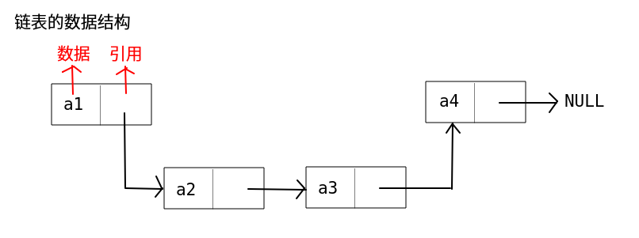

### 链表

***单链表***


1. 定义

```java
// Definition for singly-linked list.
public class SinglyListNode {
    int val;
    SinglyListNode next;
    SinglyListNode(int x) { val = x; }
}
```

使用**头结点**表示整个列表



2. 操作

查找慢 增删快

添加结点的时候 时间复杂度是O(1)

删除结点的时候 时间复杂度是O(n) 需要从头开始找到结点的前一个结点(而找到结点的后一个结点很容易)

因为链表是从头开始的 如果想删除一个链表的第一个元素的话 只需要将由结点指向第二个结点即可


双链表在 Java 中的实现为 LinkedList，在 Python 中为 list。这些结构都比较常用，有两个要点：

哨兵节点：

哨兵节点在树和链表中被广泛用作伪头、伪尾等，通常不保存任何数据。

我们将使用伪头来简化我们简化插入和删除。在接下来的两种方法中应用此方法。

双链表的双向搜索：我们可以从头部或尾部进行搜索。

***设计链表***

```java
public class ListNode {
  int val;
  ListNode next;
  ListNode(int x) { val = x; }
}

class MyLinkedList {
  int size;
  ListNode head;  // sentinel node as pseudo-head
  public MyLinkedList() {
    size = 0;
    head = new ListNode(0);
  }

  /** Get the value of the index-th node in the linked list. If the index is invalid, return -1. */
  public int get(int index) {
    // if index is invalid
    if (index < 0 || index >= size) return -1;

    ListNode curr = head;
    // index steps needed 
    // to move from sentinel node to wanted index
    for(int i = 0; i < index + 1; ++i) curr = curr.next;
    return curr.val;
  }

  /** Add a node of value val before the first element of the linked list. After the insertion, the new node will be the first node of the linked list. */
  public void addAtHead(int val) {
    addAtIndex(0, val);
  }

  /** Append a node of value val to the last element of the linked list. */
  public void addAtTail(int val) {
    addAtIndex(size, val);
  }

  /** Add a node of value val before the index-th node in the linked list. If index equals to the length of linked list, the node will be appended to the end of linked list. If index is greater than the length, the node will not be inserted. */
  public void addAtIndex(int index, int val) {
    // If index is greater than the length, 
    // the node will not be inserted.
    if (index > size) return;

    // [so weird] If index is negative, 
    // the node will be inserted at the head of the list.
    if (index < 0) index = 0;

    ++size;
    // find predecessor of the node to be added
    ListNode pred = head;
    for(int i = 0; i < index; ++i) pred = pred.next;

    // node to be added
    ListNode toAdd = new ListNode(val);
    // insertion itself
    toAdd.next = pred.next;
    pred.next = toAdd;
  }

  /** Delete the index-th node in the linked list, if the index is valid. */
  public void deleteAtIndex(int index) {
    // if the index is invalid, do nothing
    if (index < 0 || index >= size) return;

    size--;
    // find predecessor of the node to be deleted
    ListNode pred = head;
    for(int i = 0; i < index; ++i) pred = pred.next;

    // delete pred.next 
    pred.next = pred.next.next;
  }
}
```

***链表中的双指针***

看看有没有环 :

> 1. 如果没有环，快指针将停在链表的末尾。
> 2. 如果有环，快指针最终将与慢指针相遇。

一个安全的选择是每次移动慢指针`一步`，而移动快指针`两步`。每一次迭代，快速指针将额外移动一步。如果环的长度为 *M*，经过 *M* 次迭代后，快指针肯定会多绕环一周，并赶上慢指针。


***链表中的双指针问题模板***

```java
// Initialize slow & fast pointers
ListNode slow = head;
ListNode fast = head;
/**
 * Change this condition to fit specific problem.
 * Attention: remember to avoid null-pointer error
 **/
while (slow != null && fast != null && fast.next != null) {
    slow = slow.next;           // move slow pointer one step each time
    fast = fast.next.next;      // move fast pointer two steps each time
    if (slow == fast) {         // change this condition to fit specific problem
        return true;
    }
}
return false;   // change return value to fit specific problem
```

> ***注意***
>
> 它与我们在数组中学到的内容类似。但它可能更棘手而且更容易出错。你应该注意以下几点：
>
> **1. 在调用 next 字段之前，始终检查节点是否为空。**
>
> 获取空节点的下一个节点将导致空指针错误。例如，在我们运行 `fast = fast.next.next` 之前，需要检查 `fast` 和 `fast.next` 不为空。
>
> **2. 仔细定义循环的结束条件。**


***反转链表***

```java
/**
 * Definition for singly-linked list.
 * public class ListNode {
 *     int val;
 *     ListNode next;
 *     ListNode(int x) { val = x; }
 * }
 */
class Solution {
    public ListNode reverseList(ListNode head) {
        if(head == null){
            return head;
        }
        // 反转结点时 需要保存当前结点和下一个结点
        ListNode backward = head;
        ListNode forward = head.next;
        
        head.next = null; // 置可反转的next为null
        
        while(forward != null){
            head = forward;
            forward = head.next;
            
            head.next = backward;
            backward = head;
        }
        return head;
    }
}
```


***移除链表元素***

需要**哨兵**结点 防止删除的一个或多个元素在表头

> 哨兵节点广泛应用于树和链表中，如伪头、伪尾、标记等，它们是纯功能的，通常不保存任何数据，其主要目的是使链表标准化，如使链表永不为空、永不无头、简化插入和删除


```java
算法：
    初始化哨兵节点为 ListNode(0) 且设置 sentinel.next = head。
    初始化两个指针 curr 和 prev 指向当前节点和前继节点。
    当 curr != nullptr：
        比较当前节点和要删除的节点：
            若当前节点就是要删除的节点：则 prev.next = curr.next。
            否则设 prve = curr。
        遍历下一个元素：curr = curr.next。
    返回 sentinel.next。
```


***双链表***


定义

```java
// Definition for doubly-linked list.
class DoublyListNode {
    int val;
    DoublyListNode next, prev;
    DoublyListNode(int x) {val = x;}
}
```

添加


双链表在 Java 中的实现为 LinkedList，在 Python 中为 list。这些结构都比较常用，有两个要点：

- 哨兵节点：

哨兵节点在树和链表中被广泛用作***伪头、伪尾***等，通常不保存任何数据。

我们将使用***伪头***来简化我们简化***插入和删除***。在接下来的两种方法中应用此方法。

- 双链表的***双向搜索***：我们可以从头部或尾部进行搜索。


- 合并两个有序链表

  - 递归

  ```
  /**
   * Definition for singly-linked list.
   * public class ListNode {
   *     int val;
   *     ListNode next;
   *     ListNode(int x) { val = x; }
   * }
   */
  class Solution {
      public ListNode mergeTwoLists(ListNode l1, ListNode l2) {
          if(l1 == null) {
              return l2;
          }
          if(l2 == null) {
              return l1;
          }
  
          if(l1.val < l2.val) {
              l1.next = mergeTwoLists(l1.next, l2);
              return l1;
          } else {
              l2.next = mergeTwoLists(l1, l2.next);
              return l2;
          }
      }
  }
  ```

  - 迭代

  ```java
  class Solution {
      public ListNode mergeTwoLists(ListNode l1, ListNode l2) {
          ListNode prehead = new ListNode(-1);
  
          ListNode prev = prehead;
          while (l1 != null && l2 != null) {
              if (l1.val <= l2.val) {
                  prev.next = l1;
                  l1 = l1.next;
              } else {
                  prev.next = l2;
                  l2 = l2.next;
              }
              prev = prev.next;
          }
  
          // 合并后 l1 和 l2 最多只有一个还未被合并完，我们直接将链表末尾指向未合并完的链表即可
          prev.next = l1 == null ? l2 : l1;
  
          return prehead.next;
      }
  }
  ```

  


