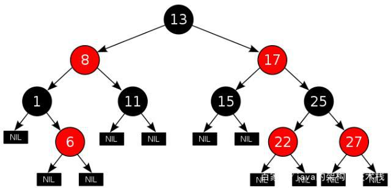
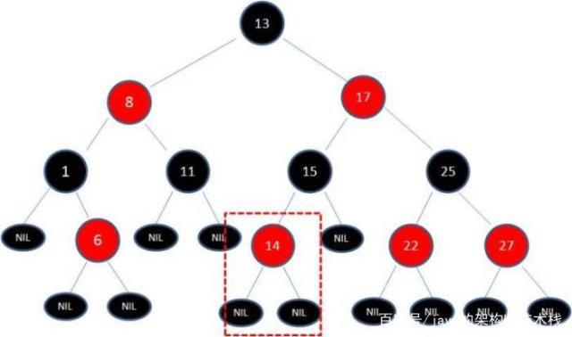
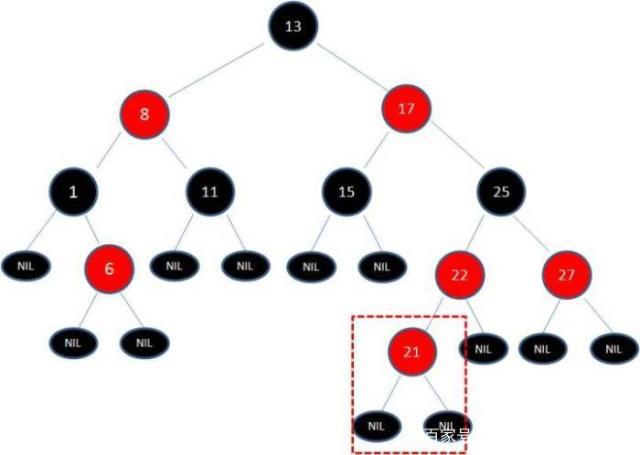
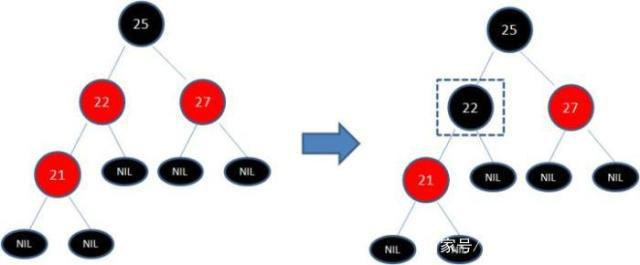
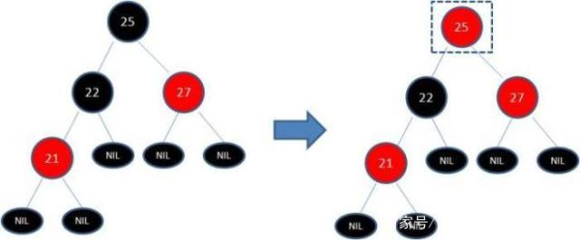
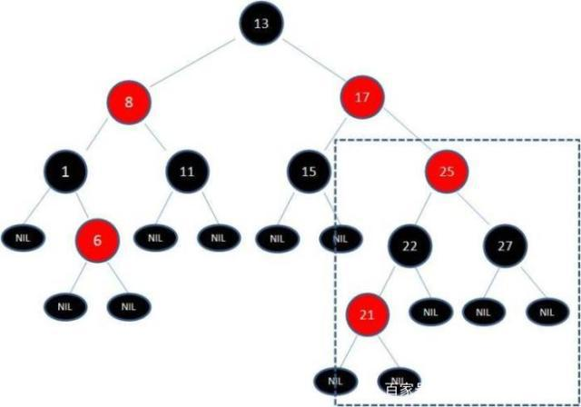
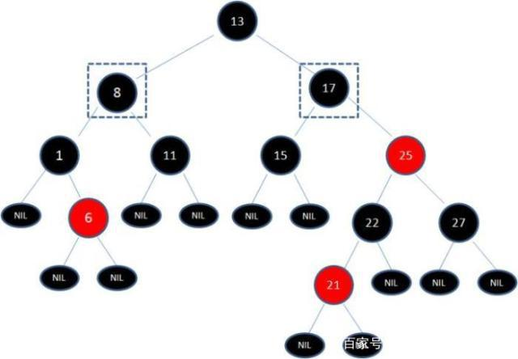
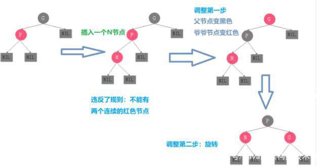
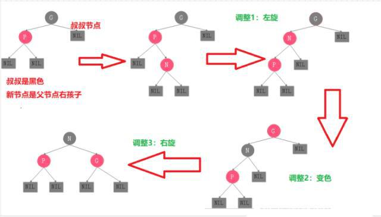

# 队列和栈

### 队列

##### 1.实现队列 

可以使用***动态数组***和指向队列***头部***的索引 如果是***按照顺序***处理数据 那么队列是一个很好的选择

代码	

```java
// "static void main" must be defined in a public class.

class MyQueue {
    // store elements
    private List<Integer> data;         
    // a pointer to indicate the start position
    private int p_start;            
    public MyQueue() {
        data = new ArrayList<Integer>();
        p_start = 0;
    }
    /** Insert an element into the queue. Return true if the operation is successful. */
    public boolean enQueue(int x) {
        data.add(x);
        return true;
    };    
    /** Delete an element from the queue. Return true if the operation is successful. */
    public boolean deQueue() {
        if (isEmpty() == true) {
            return false;
        }
        p_start++;
        return true;
    }
    /** Get the front item from the queue. */
    public int Front() {
        return data.get(p_start);
    }
    /** Checks whether the queue is empty or not. */
    public boolean isEmpty() {
        return p_start >= data.size();
    }     
};

public class Main {
    public static void main(String[] args) {
        MyQueue q = new MyQueue();
        q.enQueue(5);
        q.enQueue(3);
        if (q.isEmpty() == false) {
            System.out.println(q.Front());
        }
        q.deQueue();
        if (q.isEmpty() == false) {
            System.out.println(q.Front());
        }
        q.deQueue();
        if (q.isEmpty() == false) {
            System.out.println(q.Front());
        }
    }
}
```

缺点: 浪费空间


##### 2.循环队列

注意队列***空***还是***满***的状态

代码

```java
class MyCircularQueue {
    
    private int[] data;
    private int head;
    private int tail;
    private int size;

    /** Initialize your data structure here. Set the size of the queue to be k. */
    public MyCircularQueue(int k) {
        data = new int[k];
        head = -1;
        tail = -1;
        size = k;
    }
    
    /** Insert an element into the circular queue. Return true if the operation is successful. */
    public boolean enQueue(int value) {
        if (isFull() == true) {
            return false;
        }
        if (isEmpty() == true) {
            head = 0;
        }
        tail = (tail + 1) % size;
        data[tail] = value;
        return true;
    }
    
    /** Delete an element from the circular queue. Return true if the operation is successful. */
    public boolean deQueue() {
        if (isEmpty() == true) {
            return false;
        }
        if (head == tail) {
            head = -1;
            tail = -1;
            return true;
        }
        head = (head + 1) % size;
        return true;
    }
    
    /** Get the front item from the queue. */
    public int Front() {
        if (isEmpty() == true) {
            return -1;
        }
        return data[head];
    }
    
    /** Get the last item from the queue. */
    public int Rear() {
        if (isEmpty() == true) {
            return -1;
        }
        return data[tail];
    }
    
    /** Checks whether the circular queue is empty or not. */
    public boolean isEmpty() {
        return head == -1;
    }
    
    /** Checks whether the circular queue is full or not. */
    public boolean isFull() {
        return ((tail + 1) % size) == head;
    }
}

/**
 * Your MyCircularQueue object will be instantiated and called as such:
 * MyCircularQueue obj = new MyCircularQueue(k);
 * boolean param_1 = obj.enQueue(value);
 * boolean param_2 = obj.deQueue();
 * int param_3 = obj.Front();
 * int param_4 = obj.Rear();
 * boolean param_5 = obj.isEmpty();
 * boolean param_6 = obj.isFull();
 */
```

操作队列

```java
// "static void main" must be defined in a public class.
public class Main {
    public static void main(String[] args) {
        // 1. Initialize a queue.
        Queue<Integer> q = new LinkedList();
        // 2. Get the first element - return null if queue is empty.
        System.out.println("The first element is: " + q.peek());
        // 3. Push new element.
        q.offer(5);
        q.offer(13);
        q.offer(8);
        q.offer(6);
        // 4. Pop an element.
        q.poll();
        // 5. Get the first element.
        System.out.println("The first element is: " + q.peek());
        // 7. Get the size of the queue.
        System.out.println("The size is: " + q.size());
    }
}
```


##### 3.队列和BFS

***广度优先搜索***(BFS)的常见应用是找出***从根结点***到***目标结点***的最短路径

- 处理结点的顺序 (和树的层序遍历类似) ***越是离根结点近的越先被遍历***

- 如果在***第K轮***中将***结点X***加入队列 则根结点与X之间的最短路径***恰好是K***
- 新添加的节点`不会`立即遍历，而是在***下一轮***中处理
- 结点的处理顺序与它们`添加`到队列的顺序是***完全相同的顺序***，即先进先出（FIFO）

使用BFS的两种方案: ***遍历***和***找出最短路******径***

```markdown
在特定问题中执行 BFS 之前确定结点和边缘非常重要。通常，结点将是实际结点或是状态，而边缘将是实际边缘或可能的转换。
```

***Code I***

```java
/**
 * Return the length of the shortest path between root and target node.
 */
int BFS(Node root, Node target) {
    Queue<Node> queue;  // store all nodes which are waiting to be processed
    int step = 0;       // number of steps neeeded from root to current node
    // initialize
    add root to queue;
    // BFS
    while (queue is not empty) {
        step = step + 1;
        // iterate the nodes which are already in the queue
        int size = queue.size();
        for (int i = 0; i < size; ++i) {
            Node cur = the first node in queue;
            return step if cur is target;
            for (Node next : the neighbors of cur) {
                add next to queue;
            }
            remove the first node from queue;
        }
    }
    return -1;          // there is no path from root to target
}
```

1. 如代码所示，在每一轮中，队列中的结点是***等待处理***的结点`。
2. 在每个更外一层的 `while` 循环之后，我们***距离根结点更远一步***。变量 ***step***指示从根结点到我们正在访问的当前结点的距离。

***Code II***

确保我们***永远不会访问一个结点两次***很重要 增加一个***哈希集***来解决

```java
/**
 * Return the length of the shortest path between root and target node.
 */
int BFS(Node root, Node target) {
    Queue<Node> queue;  // store all nodes which are waiting to be processed
    Set<Node> used;     // store all the used nodes
    int step = 0;       // number of steps neeeded from root to current node
    // initialize
    add root to queue;
    add root to used;
    // BFS
    while (queue is not empty) {
        step = step + 1;
        // iterate the nodes which are already in the queue
        int size = queue.size();
        for (int i = 0; i < size; ++i) {
            Node cur = the first node in queue;
            return step if cur is target;
            for (Node next : the neighbors of cur) {
                if (next is not in used) {
                    add next to queue;
                    add next to used;
                }
            }
            remove the first node from queue;
        }
    }
    return -1;          // there is no path from root to target
}
```

不需要使用哈希集的情况:

1. 你完全确定没有循环，例如，在树遍历中；

2. 你确实希望多次将结点添加到队列中。

   

Java.util.LinkedList.poll() 方法 取到队列的头元素


红黑树

在大量查找的情况下 平衡二叉树(AVL树)也许是最好的选择,但是在增删的情况下红黑树比较好




（1）每个节点只有两种颜色：红色和黑色。

（2）根节点是黑色的。

（3）每个叶子节点（NIL）都是黑色的空节点。

（4）从根节点到叶子节点，不会出现两个连续的红色节点。

（5）从任何一个节点出发，到叶子节点，这条路径上都有相同数目的黑色节点。


***查询节点***

查询节点是最简单的一个，他的查找过程和二叉查找树一样，查找元素比当前节点大，就从右子树继续查找比较，查找元素比当前节点小，就从左子树继续查找比较。查找过程就不再赘述了。

***插入结点***

插入节点是最麻烦的一个，它分为三种情况。我们一种一种看，这样比较有条理性。

```
第一种情况：新节点没有父节点

没有父节点只有一种情况，就是插入的节点是整棵树第一个节点，也就是根节点，为此我们只需要把插入节点涂成黑色就OK了。这也就保证了性质2：根节点是黑色的。
```

```
第二种情况：新节点的父节点是黑色

为此我们举一个例子，比如说上面的红黑树中，我们插入节点14。来看一下会发生什么情况？
```



```
这种情况我们发现新插入节点14的父节点就是黑色的。现在为了保证红黑树的性质，我们对照每个特性来检查一遍。只要有一条不满足，我们都需要调整。我们重新对照之后会发现每一条都符合。此时不需要调整。
```

```
第三种情况：新节点的父亲节点为红色

我们还是举个例子，比如我们在最开始的红黑树基础之上插入节点21，此时会发生什么情况呢？
```



```
此时还是老规矩，对照着红黑树的5个特征一个一个来看，只要是违反了一条就需要做出调整。我们来看一下：

（1）每个节点只有两种颜色：红色和黑色。这一条满足。

（2）根节点是黑色的。这一条也满足。

（3）每个叶子节点（NIL）都是黑色的空节点。这一条满足。

（4）从根节点到叶子节点，不会出现两个连续的红色节点。这一条发现不满足。

就是上面这一条规则没有满足，所以我们此时需要调整？问题来了如何调整呢？因为直接看父节点没办法实现，所以还需要观察另外的节点，也就是新节点的叔叔节点。根据叔叔节点的颜色来调整。

调整的方式有两种：变色和旋转。
```

```
（1）叔叔节点是红色：

此时插入的节点是21，但是叔叔节点是27，更好是红色。我们直接来看调整的步骤：

第一步：把新节点21的父节点22变成黑色。
```



```
此时重新看一下是否满足红黑树的五条特征了没，一条一条发现，第五条没有满足，也就是从任何一个节点出发，到叶子节点，这条路径上没有相同数目的黑色节点。比如从25出发。这时候怎么办呢？那就继续调整。
```

```
第二步：把22的父节点25变成红色
```



```
这时候还是老规矩，不要嫌弃麻烦，因为只有经历了一步又一步的麻烦之后，你才能牢记那5条规则特征。我们对照之后会发现节点25和节点27是两个连续的红色节点，这时候又破坏了规则4。怎么办呢？那就继续调整就OK了。

难道这时候还要继续往上调整吗？如果你这样做就错了，因为不断地往上调整最后就会把根节点变成了红色，会走进死胡同。我们往下走。
```

```
第三步：把节点27变成黑色
```



```
来吧，继续重新审查那5条规则特征。很明显节点17和节点25是两个连续的红色，又破坏了。是不是心太累了，调整了这么久，还是没有保证那5条规则，感觉是不是还没有平衡二叉树好。如果你现在有这种感觉，我只能说，希望你继续坚持下去，胜利就在眼前。
```

```
第四步：把节点17和节点18都变成黑色节点
```



```
来来来，现在你再对照一下那5条规则，是不是完全保证了。写到这真的是太累了，和你读这篇文章的感觉一样一样的，不过这种情况也只是插入情况中的一种。
继续往下看：
```

```
（1）叔叔节点是黑色：

这种情况下又分了两种情况：

第一种情况：新插入节点为父节点的左孩子
```



```
第二种情况：新插入节点为父节点的右孩子
```



```
按照第一遍的思路，我们对这两种情况执行同样的操作，最终也能保证红黑树的5条特征。

到了这一步，插入操作的所有情况就讲解完毕。另外关于左旋和右旋的知识我在这里不再说明了，因为你看到了红黑树这个程度，相信也一定看过平衡二叉树。左旋右旋哪几种情况，都会有介绍到。
```

***删除***

```
红黑树的删除说实话更加的复杂，如果你看过算法导论的话应该能明白一点，我们在这里也进行一个大概的讲解。

删除大致分了三种情况，

（1）第一种情况：要删除的节点有零个子节点

（2）第二种情况：要删除的节点有一个子节点

（3）第三种情况：要删除的节点有两个子节点
```

***使用场景***

```
红黑树的应用真的是太多了，比如说java中的HashMap和TreeMap。还有就是linux也经常使用到。
```


##### Java中HashSet的Value为什么存PRESENT而不是Null？

既然HashSet的底层是hashMap实现的，那它的Value值为什么不直接存Null，而是要存一个叫*PRESENT的静态变量？存Null不是更好吗？*

HashSet#add() 方法需要在加入新元素时返回 true，加入重复元素时返回 false
HashMap#add() 方法返回的是上一次以同一 key 加入的 value
若从未以该 key 加入任何数据，则返回 null
然而 HashMap 允许 null 作为 value
所以如果使用 null 作为 value 利用 HashMap 
当返回 null 的时候我们就无法得知 null 究竟意味着这个 key 是第一次加入
还是上一次使用了 null 作为 value 加入

------

### 栈

栈的实现比较容易 一般用***动态数组***就可以了

```java
// "static void main" must be defined in a public class.
class MyStack {
    private List<Integer> data;               // store elements
    public MyStack() {
        data = new ArrayList<>();
    }
    /** Insert an element into the stack. */
    public void push(int x) {
        data.add(x);
    }
    /** Checks whether the queue is empty or not. */
    public boolean isEmpty() {
        return data.isEmpty();
    }
    /** Get the top item from the queue. */
    public int top() {
        return data.get(data.size() - 1);
    }
    /** Delete an element from the queue. Return true if the operation is successful. */
    public boolean pop() {
        if (isEmpty()) {
            return false;
        }
        data.remove(data.size() - 1);
        return true;
    }
};

public class Main {
    public static void main(String[] args) {
        MyStack s = new MyStack();
        s.push(1);
        s.push(2);
        s.push(3);
        for (int i = 0; i < 4; ++i) {
            if (!s.isEmpty()) {
                System.out.println(s.top());
            }
            System.out.println(s.pop());
        }
    }
}
```

栈-用法

初始化 入栈 出栈

```java
// "static void main" must be defined in a public class.
public class Main {
    public static void main(String[] args) {
        // 1. Initialize a stack.
        Stack<Integer> s = new Stack<>();
        // 2. Push new element.
        s.push(5);
        s.push(13);
        s.push(8);
        s.push(6);
        // 3. Check if stack is empty.
        if (s.empty() == true) {
            System.out.println("Stack is empty!");
            return;
        }
        // 4. Pop an element.
        s.pop();
        // 5. Get the top element.
        System.out.println("The top element is: " + s.peek());
        // 6. Get the size of the stack.
        System.out.println("The size is: " + s.size());
    }
}
```

当你想首先处理最后一个元素时，栈将是最合适的数据结构。

------

### 栈和深度优先搜索

在 DFS 中找到的第一条路径***并不总是最短***的路径。例如，在上面的例子中，我们成功找出了路径 `A-> C-> F-> G` 并停止了 DFS。但这不是从 `A` 到 `G` 的最短路径。

**栈的入栈和退栈顺序是什么？**

如上面的动画所示，我们首先将***根结点***推入到栈中；然后我们尝试第一个邻居 `B` 并将结点 `B` 推入到栈中；等等等等。当我们到达***最深***的结点 `E` 时，我们需要***回溯***。当我们回溯时，我们将从栈中弹出***最深***的结点，这实际上是推入到栈中的***最后一个结点***。

结点的处理顺序是***完全相反***的顺序，就像它们被`添加`到栈中一样，它是***后进先出（LIFO）***。这就是我们在 DFS 中使用栈的原因。

***DFS 模板 I***

在大多数情况下，我们在能使用 BFS 时也可以使用 DFS。但是有一个重要的区别：***遍历顺序***。

与 BFS 不同，更早访问的结点可能不是更靠近根结点的结点。因此，你在 DFS 中找到的第一条路径可能不是最短路径`。

```java
/*
 * Return true if there is a path from cur to target.
 */
boolean DFS(Node cur, Node target, Set<Node> visited) {
    return true if cur is target;
    for (next : each neighbor of cur) {
        if (next is not in visited) {
            add next to visted;
            return true if DFS(next, target, visited) == true;
        }
    }
    return false;
}
```

当我们递归地实现 DFS 时，似乎不需要使用任何栈。但实际上，我们使用的是由系统提供的隐式栈，也称为调用栈（[Call Stack](https://en.wikipedia.org/wiki/Call_stack)）。

在最坏的情况下，维护系统栈需要 O(h)，其中 h 是 DFS 的最大深度。在计算空间复杂度时，永远不要忘记考虑系统栈。

> 在上面的模板中，我们在找到`第一条`路径时停止。
>
> 如果你想找到`最短`路径呢？
>
> 提示：再添加一个参数来指示你已经找到的最短路径。

二叉树中序遍历(递归法)

```java
class Solution {
    public List < Integer > inorderTraversal(TreeNode root) {
        List < Integer > res = new ArrayList < > ();
        helper(root, res);
        return res;
    }

    public void helper(TreeNode root, List < Integer > res) {
        if (root != null) {
            if (root.left != null) {
                helper(root.left, res);
            }
            res.add(root.val);
            if (root.right != null) {
                helper(root.right, res);
            }
        }
    }
}

```


